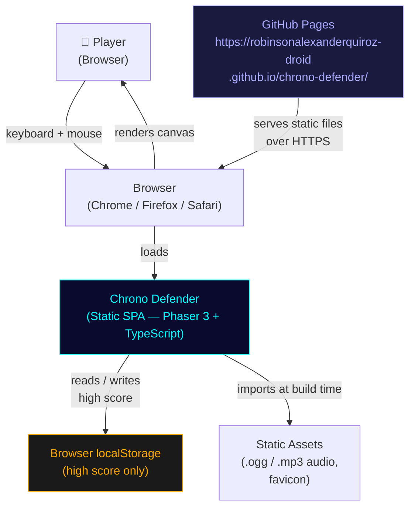
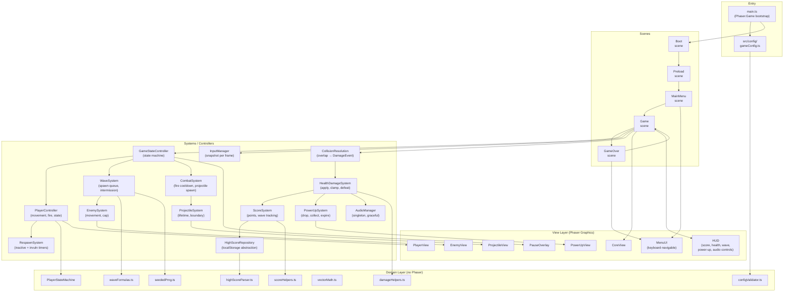
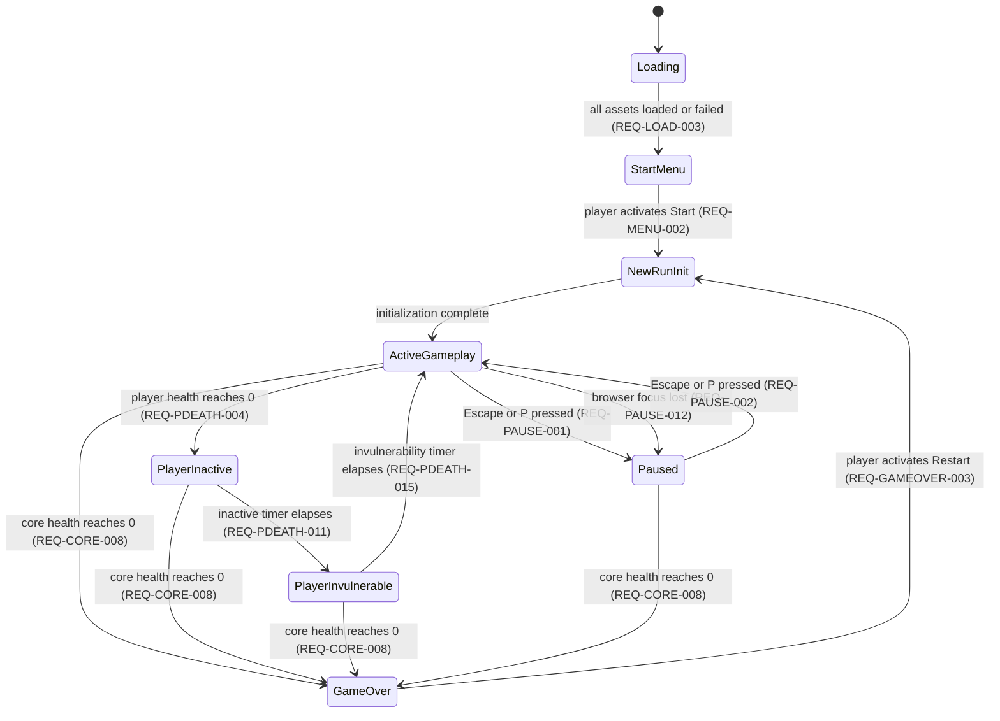

# Chrono Defender – Technical Design

---

## 1. Document Metadata

| Field | Value |
|---|---|
| Project | Chrono Defender |
| Spec | core-game |
| Design status | Draft — awaiting review |
| Requirements | `.kiro/specs/core-game/requirements.md` |
| Repository | `robinsonalexanderquiroz-droid/chrono-defender` |
| Production base path | `/chrono-defender/` |
| GitHub Pages URL | `https://robinsonalexanderquiroz-droid.github.io/chrono-defender/` |
| Node version | 20 |
| Generated | 2026-07-26 |

**Unresolved items carried forward:**
1. Audio asset source — procedural generation (Web Audio API offline context) vs. CC0 library; deferred to the audio implementation task. CC-BY assets require attribution documentation.
2. Tunable balance values — wave scaling, enemy stats, and power-up multipliers are marked `TUNABLE` in Section 9; they require playtesting, not design approval.

**Resolved:**
- Browser support target: latest two major released versions of Chrome, Edge, Firefox, and Safari.
- Playwright smoke-test browsers: Chromium, Firefox, WebKit.
- GitHub repository, Vite base path, and all Actions SHA pins: see `ci-cd.md`.

---

## 2. Design Summary

### Player Experience

The player pilots a ship around a central energy core, intercepting geometric enemies that converge on it from the screen edges. Enemies grow more numerous, faster, and more durable with each wave. The run ends only when the core's health reaches zero. A player death triggers a 3-second respawn pause followed by 2 seconds of invulnerability, so mistakes are recoverable. Every ten enemy defeats drops a power-up cycling through fire-rate boost, speed boost, and health restore. The game is endless; the player's goal is to push score and wave number as high as possible.

### Core Gameplay Loop

```
Load assets → Start Menu → Wave begins → Intercept enemies
→ [enemy defeated → score + power-up progress]
→ [wave cleared → intermission → next wave]
→ [player health = 0 → inactive 3 s → respawn → invulnerable 2 s → active]
→ [core health = 0 → Game Over → persist high score → restart option]
```

### Architectural Approach

The design separates concerns into three layers:

1. **Domain layer** (`src/domain/`) — pure TypeScript: game rules, state machines, formulas, and data transforms. Zero Phaser imports. Fully testable with Vitest without a browser.
2. **Systems layer** (`src/systems/`) — orchestrates domain logic within the Phaser lifecycle. Holds references to Phaser scene objects but keeps rule logic delegated to the domain layer.
3. **View layer** (`src/entities/` view classes, `src/ui/`) — reads domain state and renders it via Phaser Graphics / GameObjects. Game logic never calls Phaser Graphics directly.

This separation means the wave formula, damage resolution, scoring, and state-machine transitions are all independently unit-testable, while Phaser handles rendering, physics overlap detection, and scene management.

### Static Deployment Suitability

The entire game is a static bundle of HTML, JavaScript, and audio files. No server-side code, authentication, or runtime secrets are needed. Vite produces a `dist/` folder that GitHub Pages serves directly. The `base: '/chrono-defender/'` path ensures asset URLs resolve correctly under the Pages sub-path.

---

## 3. Design Principles

| # | Principle | Rationale |
|---|---|---|
| P-01 | Requirements-driven implementation | Every component traces to a REQ-* identifier. |
| P-02 | Deterministic, independently testable game rules | Domain logic has no Phaser dependency; Vitest can run it without a browser. |
| P-03 | Composition over deep inheritance | Enemy types share a common `EnemyConfig` interface; behaviour differences are data-driven, not subclass-driven. |
| P-04 | Strict TypeScript (`strict: true`) | Catches whole classes of runtime errors at compile time. |
| P-05 | Centralized typed configuration | All tunable numbers live in `src/config/`; no magic literals in logic. |
| P-06 | Small, focused modules | Each file has one primary responsibility; the `import-x/no-cycle` ESLint rule enforces boundaries. |
| P-07 | Explicit state transitions | Player state, game state, and wave state are managed by dedicated state-machine classes, not scattered boolean flags. |
| P-08 | Controlled mutable state | Mutable state is owned by a single module; all mutations go through defined methods, never direct field assignment from outside. |
| P-09 | No hidden global mutable singletons for gameplay | `AudioManager` and `HighScoreRepository` are the only singletons; they hold no gameplay state. |
| P-10 | Least privilege | CI workflow is read-only; deploy workflow requests only `pages: write` and `id-token: write`; localStorage stores only score. |
| P-11 | Graceful failure | Audio errors, asset-load failures, and localStorage exceptions are caught at the boundary and never propagate to the game loop. |
| P-12 | Accessibility by design | Shape + label + value always accompany color; flash rate ≤ 3 Hz; WCAG AA contrast enforced. |
| P-13 | No runtime secrets | The build is a fully static site; no API keys, tokens, or environment variables reach the browser. |

---

## 4. System Context Diagram



**What is absent by design:**
- No backend server
- No authentication system
- No remote database
- No analytics endpoint
- No runtime secrets

localStorage stores only the integer high score under a versioned key. No personal data, telemetry, or session tokens are stored.

---

## 5. Component Architecture



**Dependency direction rules** (enforced by `import-x/no-cycle`):
- `Domain` imports from `config/` and `utils/` only — never from Phaser or systems
- `Systems` import from `domain/`, `config/`, `utils/`
- `ViewLayer` imports from `config/` and `utils/`; receives data via method calls, not direct state access
- `Scenes` import from `systems/`, `ui/`, `config/`, `utils/`
- No layer imports from `scenes/`

---

## 6. Proposed Directory Structure

```
chrono-defender/
├── .github/
│   └── workflows/              # ci.yml, deploy.yml, codeql.yml — created in dedicated tasks
├── .kiro/
│   ├── steering/               # Approved steering documents
│   └── specs/core-game/        # requirements.md, design.md, tasks.md
├── docs/
│   └── presentation-script.md  # Created when project is demo-ready
├── public/
│   └── favicon.ico
├── src/
│   ├── assets/
│   │   └── audio/              # .ogg and .mp3 sound effect files only; no binary art
│   ├── config/
│   │   ├── gameConfig.ts       # Phaser.Types.Core.GameConfig + canvas settings
│   │   ├── playerConfig.ts     # Health, speed, respawn, cooldown, projectile
│   │   ├── enemyConfig.ts      # EnemyDefinition records for Basic / Fast / Durable
│   │   ├── waveConfig.ts       # Scaling formulas, intermission, active-enemy cap
│   │   ├── powerUpConfig.ts    # Drop interval, type sequence, durations, multipliers
│   │   ├── audioConfig.ts      # Asset keys, volume defaults
│   │   ├── storageConfig.ts    # localStorage keys, max score boundary
│   │   └── index.ts            # Re-exports + configValidator call at import time
│   ├── domain/
│   │   ├── PlayerStateMachine.ts   # ACTIVE | INACTIVE | INVULNERABLE transitions
│   │   ├── GameStateMachine.ts     # LOADING | MENU | PLAYING | PAUSED | GAME_OVER
│   │   ├── waveFormulas.ts         # Pure functions: enemyCount(wave), spawnInterval(wave), …
│   │   ├── damageHelpers.ts        # clampHealth(), applyDamage(), isDefeated()
│   │   ├── scoreHelpers.ts         # addScore(), clampScore(), isValidDefeat()
│   │   ├── powerUpHelpers.ts       # nextPowerUpType(), clampSpawnPosition()
│   │   ├── highScoreParser.ts      # parseStoredScore() — validates all edge cases
│   │   ├── seededPrng.ts           # Mulberry32 or similar; seed(n) → () => number
│   │   ├── vectorMath.ts           # normalize(), angle(), clampToRect()
│   │   └── configValidator.ts      # Throws descriptive errors for invalid config at startup
│   ├── scenes/
│   │   ├── Boot.ts
│   │   ├── Preload.ts
│   │   ├── MainMenu.ts
│   │   ├── Game.ts
│   │   └── GameOver.ts
│   ├── systems/
│   │   ├── GameStateController.ts  # Owns GameStateMachine; drives scene transitions
│   │   ├── InputManager.ts         # Reads Phaser input; exposes InputSnapshot
│   │   ├── PlayerController.ts     # Movement, facing, fire delegation; owns PlayerStateMachine
│   │   ├── RespawnSystem.ts        # Inactive timer, respawn trigger, invuln timer
│   │   ├── CombatSystem.ts         # Cooldown tracking, projectile spawn requests
│   │   ├── ProjectileSystem.ts     # Lifetime, boundary removal, active-cap enforcement
│   │   ├── EnemySystem.ts          # Per-frame movement toward core, boundary removal
│   │   ├── WaveSystem.ts           # Spawn queue, intermission, wave-complete detection
│   │   ├── CollisionResolution.ts  # Records Phaser overlap events; emits CollisionEvent list
│   │   ├── HealthDamageSystem.ts   # Applies CollisionEvents; emits DefeatEvents, CoreGameOverEvent
│   │   ├── ScoreSystem.ts          # Owns ScoreState; updates on DefeatEvent and wave completion
│   │   ├── PowerUpSystem.ts        # Owns defeat counter, cycle index, active power-ups
│   │   └── AudioManager.ts         # Singleton; wraps Phaser Sound Manager; canonical location
│   ├── entities/
│   │   ├── PlayerEntity.ts         # Physics body + PlayerView; no domain logic
│   │   ├── EnemyEntity.ts          # Physics body + EnemyView; holds EnemyState ref
│   │   ├── ProjectileEntity.ts     # Physics body + ProjectileView
│   │   ├── CoreEntity.ts           # Static body + CoreView
│   │   └── PowerUpEntity.ts        # Physics body + PowerUpView
│   ├── ui/
│   │   ├── HUD.ts                  # Score, health bars, wave, power-up indicator, audio controls
│   │   ├── PauseOverlay.ts         # "PAUSED" overlay, resume instruction
│   │   ├── MenuUI.ts               # Keyboard-navigable menu component (used by MainMenu, GameOver)
│   │   └── RespawnOverlay.ts       # Countdown during inactive state; invuln indicator
│   ├── persistence/
│   │   └── HighScoreRepository.ts  # Abstracts localStorage; injectable in tests
│   ├── types/
│   │   ├── GameState.ts            # GameState, RunState, PlayerLifecycleState enums/unions
│   │   ├── EnemyTypes.ts           # EnemyType enum, EnemyDefinition interface
│   │   ├── PowerUpTypes.ts         # PowerUpType enum, ActivePowerUp interface
│   │   ├── Events.ts               # DamageEvent, DefeatEvent, CollisionEvent, DomainEvent
│   │   └── InputSnapshot.ts        # InputSnapshot interface
│   ├── utils/
│   │   ├── mathUtils.ts            # clamp(), lerp(), normalizeVector(), angleBetween()
│   │   ├── idGenerator.ts          # Monotonic integer ID for entity deduplication
│   │   └── logger.ts               # Dev-only logger; no-ops in production build
│   └── main.ts                     # Creates Phaser.Game with config; calls configValidator
├── tests/
│   ├── unit/
│   │   ├── domain/                 # PlayerStateMachine, waveFormulas, damageHelpers, …
│   │   ├── systems/                # ScoreSystem, PowerUpSystem, WaveSystem (no Phaser)
│   │   ├── persistence/            # HighScoreRepository with mock localStorage
│   │   └── utils/                  # mathUtils, idGenerator, seededPrng
│   ├── integration/
│   │   └── gameLoop/               # Multi-system interaction tests with fake timers
│   └── e2e/
│       └── smoke.spec.ts           # Playwright: load → canvas → start → gameplay → game-over
├── index.html
├── vite.config.ts
├── vitest.config.ts
├── playwright.config.ts
├── tsconfig.json
├── eslint.config.js
├── .prettierrc
├── .nvmrc                          # "20"
├── .gitignore
├── LICENSE                         # MIT
├── README.md
└── package.json
```

**Directory ownership and boundary rules:**

| Directory | Owns | Must not contain | May import from |
|---|---|---|---|
| `domain/` | Pure game rules, formulas, parsers | Phaser, DOM, fetch | `config/`, `utils/`, `types/` |
| `systems/` | Orchestration, timers, state, `AudioManager` | Direct Phaser Graphics calls | `domain/`, `config/`, `utils/`, `types/` |
| `entities/` | Phaser physics bodies + view delegation | Domain rule logic | `config/`, `utils/`, `types/` |
| `scenes/` | Phaser Scene lifecycle | Business logic | `systems/`, `entities/`, `ui/`, `config/`, `utils/`, `types/` |
| `ui/` | Phaser GameObjects for HUD/menus | Domain logic, direct state mutation | `config/`, `utils/`, `types/` |
| `persistence/` | Storage I/O abstraction | Gameplay state | `domain/`, `config/`, `types/` |
| `utils/` | Pure functions | All game state | nothing outside `utils/` |
| `types/` | Shared interfaces and enums | Implementation | nothing |
| `config/` | Typed constants and validator | Mutable state | `types/`, `utils/` |

---

## 7. Game-State Model

### State Diagram



### State Definitions

| State | Entry Actions | Active Behavior | Exit Actions | Prohibited transitions in |
|---|---|---|---|---|
| `Loading` | Start Phaser asset loader; show progress bar | Update progress display; catch load errors | — | Pause, game-over, restart |
| `StartMenu` | Read high score from repository; set keyboard focus to Start button | Keyboard navigation; audio controls active | — | Direct to game-over |
| `NewRunInit` | Reset all run state (score=0, health=max, wave=1, defeat counter=0, cycle=0); cancel prior timers; remove prior entities | — | — | None |
| `ActiveGameplay` | Resume all game-clock timers; enable input processing | Full update loop (see Section 8) | Disable input; suspend timers | From Loading, StartMenu (direct) |
| `Paused` | Suspend all game-clock timers; show pause overlay; stop audio | Process only pause-toggle input | Remove overlay; resume timers | Nested pause |
| `PlayerInactive` | Set player physics body inactive; start inactive timer (3 000 ms game clock) | World continues; player invisible/non-collidable | Cancel inactive timer; teleport player to respawn position | Movement/firing/collection |
| `PlayerInvulnerable` | Restore player health to max; start invuln timer (2 000 ms); show invuln indicator | Normal movement and firing; ignore incoming damage | Remove invuln indicator | None (can still take damage path → ignored) |
| `GameOver` | Stop all timers; remove all entities; write high score; play game-over SFX | Keyboard navigation; show final score | — | Pause |

### Transition Priority (same-frame conflicts)

When multiple transition triggers fire in the same update tick, this priority order applies:

1. **Core health → 0** (game-over) — always wins; overrides any pending player state transition. This applies from **any** run state including `Paused`. Normal gameplay systems do not continue damaging the core while paused; however, this transition is defined to preserve state-machine correctness and to handle any queued or externally detected damage event that arrives during the same frame as a pause. If a pending player-death transition and a game-over event both exist in the same frame, the game-over transition is applied and the pending player-death transition is discarded.
2. **Player health → 0** (inactive) — queued at step 11; processed at step 4 of the **next** frame (see Section 8 and Section 17). Processed only if no game-over transition is pending.
3. **Pause toggle** — processed only in `ActiveGameplay`, `PlayerInactive`, or `PlayerInvulnerable`; debounced for one frame after death transition (REQ-PAUSE-011).
4. **Timer expiry** (inactive → invulnerable, invulnerable → active) — processed after damage/defeat in the same tick.

### Focus-Loss Behavior

- On `window.blur`: `GameStateController` transitions `ActiveGameplay` → `Paused` automatically (REQ-PAUSE-012).
- On `window.focus`: state remains `Paused`; player must press Escape or P to resume (REQ-PAUSE-013).
- Focus events are registered once per Game scene and removed on scene shutdown.

---

## 8. Game Clock and Update Model

### Clock Strategy

All time-dependent game logic uses **Phaser scene time** (`scene.time`), not `Date.now()` or `performance.now()`. Phaser's scene time automatically pauses when `scene.pause()` is called, giving correct timer suspension with no extra work.

Timers created via `scene.time.addEvent({ delay, callback })` suspend automatically when the scene pauses. Systems that track elapsed time store a `startTime` snapshot and compute `scene.time.now - startTime` rather than accumulating deltas, so resume is exact (REQ-PAUSE-006).

### Phaser Physics and the Custom Update Sequence

Phaser Arcade Physics processes overlap and collision detection during its own internal pre-update phase, **before** the user-defined `scene.update()` method is invoked. This means that by the time `Game.update()` begins executing the 17-step sequence below, Phaser has already evaluated all overlap pairs for the frame.

The application **does not apply any gameplay effects inside Phaser overlap callbacks**. Callbacks only perform one task: they record a normalized `CollisionEvent` candidate into a per-frame list. All gameplay consequences (damage, defeat, collection, game-over) are derived from that list during the domain collision-resolution step (step 10).

This design makes power-up collection versus expiration priority, damage ordering, and entity-removal ordering fully deterministic and testable without relying on any assumed or undocumented Phaser-internal callback ordering. The `CollisionResolution.resolve()` call at step 10 consumes the already-populated event list; it does not re-query Phaser's physics state.

### Large Delta Handling

Phaser calls `update(time, delta)`. If `delta` exceeds a configured ceiling (e.g. 100 ms — approximately two missed frames at 60 fps), the system caps it at that ceiling. This prevents entities from teleporting through boundaries after a tab-switch or browser stall.

### Test Clock Strategy

Domain logic that depends on elapsed time accepts a `clock` parameter typed as `{ now: number }`. Vitest passes a simple object whose `now` value is advanced manually, eliminating real-time `setTimeout` calls in tests (REQ-QUAL-007).

### Update Order (one game tick)

The `Game` scene's `update(time, delta)` method calls systems in this order:

| Step | System | Notes |
|---|---|---|
| 1 | `InputManager.capture()` | Snapshots key and pointer state for this frame; result is an immutable `InputSnapshot` |
| 2 | `GameStateController.validate()` | Asserts no illegal state combination; throws in dev, logs in production |
| 3 | *(Phaser advances its internal clock)* | `scene.time.now` is authoritative |
| 4 | `GameStateController.processTransitions(snapshot)` | Evaluates pause toggle, focus-loss auto-pause; applies priority order from Section 7 |
| 5 | `PlayerController.update(snapshot, delta)` | Movement, facing rotation; skipped when paused or inactive |
| 6 | `WaveSystem.update()` | Checks intermission timer; dequeues pending spawns if under cap |
| 7 | `EnemySystem.update(delta)` | Moves all active enemies toward core; skipped when paused |
| 8 | `ProjectileSystem.update(delta)` | Advances projectiles; removes expired or out-of-bounds ones |
| 9 | `CombatSystem.update(snapshot)` | Evaluates fire-cooldown; spawns projectile if eligible |
| 10 | `CollisionResolution.resolve()` | Consumes the per-frame `CollisionEvent` list already populated by Phaser's pre-update physics pass; applies `markedForRemoval` guards; emits deduplicated events for domain processing. No gameplay effects are applied here — callbacks only record candidates. |
| 11 | `HealthDamageSystem.process(events)` | Applies damage in deterministic order; emits `DefeatEvent`s and `CoreGameOverEvent` if applicable |
| 12 | `ScoreSystem.process(defeatEvents)` | Awards points; increments wave tracker; prevents duplicates via entity ID set |
| 13 | `PowerUpSystem.process(defeatEvents, snapshot)` | Increments defeat counter; spawns power-up at threshold; evaluates collection and expiration |
| 14 | `RespawnSystem.update()` | Checks inactive timer → triggers respawn; checks invuln timer → restores active state |
| 15 | `HealthDamageSystem.removeMarked()` | Destroys entities flagged for removal; cleans up listeners and timers |
| 16 | `HUD.update(runState)` | Redraws score, health bars, wave number, power-up indicators, respawn countdown |
| 17 | `AudioManager.flushEvents(audioEvents)` | Plays queued sound-effect triggers from this frame |

**Why this order:** Capture input first so the entire frame uses a consistent snapshot. Transition checks before movement prevent processing a frame in an invalid state. Movement before spawning ensures new enemies appear at frame-consistent positions. Collision resolution (step 10) consumes the event list that Phaser's pre-update physics pass already populated — no Phaser state is re-queried here. Damage after collision ensures clean event flow. Score and power-up after damage ensures they see the final defeat list. Respawn after damage prevents a second death from firing in the same frame the respawn starts. Entity removal after all logic prevents dangling references during the frame. HUD and audio last so they reflect the final state of the frame.

**Player-death timing note:** When `HealthDamageSystem` (step 11) reduces player health to zero, it queues a pending player-death transition rather than invoking `GameStateController` immediately. `GameStateController.processTransitions()` at step 4 of the **next** frame evaluates this queued transition. During the remainder of the current frame after step 11, the player is marked as having reached zero health and the `PlayerStateMachine` transition guard prevents a duplicate death request. If a core game-over event also fires in the same frame (step 11, higher priority), the queued player-death transition is discarded at step 4 of the next frame in favour of the game-over state. This one-frame delay is intentional, deterministic, and has no perceptible effect on gameplay.

---

## 9. Configuration Model

All configuration lives in `src/config/`. Every value has a TypeScript type, a valid range, validation behavior, and a failure mode. `configValidator.ts` is called synchronously at module import time in `main.ts`; invalid config throws a descriptive `Error` before the Phaser game is constructed (REQ-PERF-007).

### Canvas and Resolution

| Key | Type | Value | Notes |
|---|---|---|---|
| `LOGICAL_WIDTH` | `number` | `1280` | Logical canvas width in pixels |
| `LOGICAL_HEIGHT` | `number` | `720` | Logical canvas height in pixels |
| `ASPECT_RATIO` | `number` | `16/9` | Derived; used for scale validation |
| `MIN_VIEWPORT_WIDTH` | `number` | `800` | CSS pixels; below this show unsupported message |
| `MIN_VIEWPORT_HEIGHT` | `number` | `450` | CSS pixels (800×450 is 16:9) |

### Player

| Key | Type | TUNABLE | Valid range | On invalid |
|---|---|---|---|---|
| `PLAYER_MAX_HEALTH` | `number` | yes | integer ≥ 1 | throw |
| `PLAYER_MOVE_SPEED` | `number` | yes | > 0, ≤ 2000 px/s | throw |
| `PLAYER_INACTIVE_DURATION` | `number` | no | `3000` ms | throw if ≠ positive integer |
| `PLAYER_INVULN_DURATION` | `number` | no | `2000` ms | throw if ≠ positive integer |
| `PLAYER_RESPAWN_X` | `number` | yes | within playable area | throw if outside |
| `PLAYER_RESPAWN_Y` | `number` | yes | within playable area | throw if outside |
| `PLAYER_HITBOX_RADIUS` | `number` | yes | > 0 | throw |

### Combat and Projectile

| Key | Type | TUNABLE | Valid range | On invalid |
|---|---|---|---|---|
| `FIRE_COOLDOWN_MS` | `number` | yes | integer > 0 | throw |
| `PROJECTILE_SPEED` | `number` | yes | > 0 | throw |
| `PROJECTILE_LIFETIME_MS` | `number` | yes | integer > 0 | throw |
| `PROJECTILE_DAMAGE` | `number` | yes | integer ≥ 1 | throw |
| `MAX_ACTIVE_PROJECTILES` | `number` | yes | integer ≥ 1, ≤ 200 | throw |
| `PROJECTILE_SPAWN_OFFSET` | `number` | yes | ≥ 0 | throw |
| `FIRE_RATE_BOOST_MULTIPLIER` | `number` | yes | > 1 | throw |

### Enemy Definitions

Enemy types are expressed as a typed record, not separate constants:

```typescript
interface EnemyDefinition {
  type: EnemyType;           // 'basic' | 'fast' | 'durable'
  maxHealth: number;         // integer ≥ 1
  speed: number;             // px/s > 0
  contactDamage: number;     // integer ≥ 1
  scoreValue: number;        // integer ≥ 0
  hitboxRadius: number;      // > 0
  shape: EnemyShape;         // 'diamond' | 'triangle' | 'hexagon' — visual contract
}
```

Validation enforces: `fast.maxHealth < basic.maxHealth < durable.maxHealth` and `durable.speed < basic.speed < fast.speed`.

### Wave

| Key | Type | TUNABLE | Notes |
|---|---|---|---|
| `MAX_ACTIVE_ENEMIES` | `number` | yes | integer ≥ 1; hard cap |
| `INTERMISSION_DURATION_MS` | `number` | yes | integer > 0 |
| `BASE_ENEMY_COUNT` | `number` | yes | enemies in wave 1 |
| `ENEMY_COUNT_GROWTH` | `number` | yes | additive per wave |
| `ENEMY_COUNT_MAX` | `number` | yes | ceiling to prevent overflow |
| `SPAWN_INTERVAL_BASE_MS` | `number` | yes | ms between spawns at wave 1 |
| `SPAWN_INTERVAL_FLOOR_MS` | `number` | yes | minimum interval; prevents zero |
| `SPEED_SCALE_PER_WAVE` | `number` | yes | multiplier applied to base speed |
| `HEALTH_SCALE_PER_WAVE` | `number` | yes | multiplier applied to base health |
| `PRNG_SEED` | `number` | yes | integer; 0 = deterministic default |

Wave formulas (all pure functions in `waveFormulas.ts`):

```
enemyCount(wave)    = clamp(BASE + GROWTH * (wave - 1), 1, ENEMY_COUNT_MAX)
spawnInterval(wave) = clamp(BASE_MS / wave^0.5, FLOOR_MS, BASE_MS)
speedMultiplier(wave) = 1 + SPEED_SCALE * (wave - 1)
healthMultiplier(wave) = 1 + HEALTH_SCALE * (wave - 1)
```

All multiplier results are clamped to safe upper bounds defined in config.

### Power-Up

| Key | Type | TUNABLE | Notes |
|---|---|---|---|
| `POWERUP_DROP_INTERVAL` | `number` | no | `10` valid defeats |
| `POWERUP_FIRE_RATE_MULTIPLIER` | `number` | yes | e.g. `0.5` (halves cooldown) |
| `POWERUP_SPEED_MULTIPLIER` | `number` | yes | e.g. `1.5` |
| `POWERUP_HEALTH_RESTORE` | `number` | yes | integer, clamped to max health |
| `POWERUP_FIRE_DURATION_MS` | `number` | yes | active duration |
| `POWERUP_SPEED_DURATION_MS` | `number` | yes | active duration |
| `POWERUP_EXPIRY_MS` | `number` | yes | time before uncollected drop disappears |
| `POWERUP_TYPE_SEQUENCE` | `PowerUpType[]` | no | `['fire-rate','move-speed','health']` |

### Core

| Key | Type | TUNABLE | Notes |
|---|---|---|---|
| `CORE_MAX_HEALTH` | `number` | yes | integer ≥ 1 |
| `CORE_HITBOX_RADIUS` | `number` | yes | > 0 |

### Score and Storage

| Key | Type | Notes |
|---|---|---|
| `MAX_SCORE` | `number` | `Number.MAX_SAFE_INTEGER` |
| `STORAGE_KEY_HIGH_SCORE` | `string` | `'cd_v1_highscore'` — versioned key |
| `STORAGE_KEY_AUDIO_MUTED` | `string` | `'cd_v1_muted'` |
| `STORAGE_KEY_AUDIO_VOLUME` | `string` | `'cd_v1_volume'` |

### Audio

| Key | Type | Notes |
|---|---|---|
| `AUDIO_DEFAULT_VOLUME` | `number` | `0.7`; range 0.0–1.0 |
| `AUDIO_DEFAULT_MUTED` | `boolean` | `false` |
| `SFX_KEYS` | `Record<SfxEvent, string>` | Asset keys for each SFX event |

---

## 10. Core Domain Data Models

### `GameState` (enum)
```typescript
type GameState = 'LOADING' | 'MENU' | 'NEW_RUN_INIT' | 'PLAYING' | 'PAUSED' | 'GAME_OVER';
```
Owned by `GameStateMachine`. Immutable once set per frame; transitions go through `transition(next: GameState)`.

### `PlayerLifecycleState` (enum)
```typescript
type PlayerLifecycleState = 'ACTIVE' | 'INACTIVE' | 'INVULNERABLE';
```
Owned by `PlayerStateMachine`. Transitions validated against allowed pairs (ACTIVE→INACTIVE, INACTIVE→INVULNERABLE, INVULNERABLE→ACTIVE). Duplicate transitions are no-ops (REQ-PDEATH-020).

### `RunState`
```typescript
interface RunState {
  score: number;                   // current run score, 0..MAX_SCORE
  defeatCounter: number;           // total valid defeats this run, 0..n
  powerUpCycleIndex: number;       // 0=fire-rate, 1=speed, 2=health; wraps mod 3
}
```
Owned by `GameStateController`. Reset on `NEW_RUN_INIT`. Defeat counter and cycle index survive player death.

**Wave-state ownership note:** `RunState` does not contain a `wave` field. `WaveState.waveNumber` (owned by `WaveSystem`) is the single authoritative current-wave counter. The HUD and `GameOver` scene read the current wave number directly from `WaveSystem` or from an immutable `RunSnapshot` derived from `WaveState` at display time. Having a second mutable `wave` field in `RunState` would create two sources of truth and is explicitly prohibited.

**Highest-completed-wave ownership note:** `ScoreState.highestCompletedWave` (owned by `ScoreSystem`) is the single authoritative value for the game-over summary. `RunState` does not contain a `highestCompletedWave` field. `WaveSystem` notifies `ScoreSystem` exactly once when a wave is validly completed (intermission begins); `ScoreSystem` updates `highestCompletedWave` without duplicating any wave-number counter.

### `PlayerState`
```typescript
interface PlayerState {
  health: number;                  // 0..PLAYER_MAX_HEALTH
  lifecycleState: PlayerLifecycleState;
  inactiveTimerStart: number | null;   // game clock ms; null when not inactive
  invulnTimerStart: number | null;     // game clock ms; null when not invuln
  position: { x: number; y: number }; // world coords
  facingAngle: number;                 // radians
  fireCooldownEnd: number;             // game clock ms when next fire is allowed
  activePowerUps: ActivePowerUp[];
}
```

### `CoreState`
```typescript
interface CoreState {
  health: number;   // 0..CORE_MAX_HEALTH; 0 triggers game-over
  maxHealth: number;
  position: { x: number; y: number }; // fixed; set once at run init
}
```
Invariant: `health` is always clamped to `[0, maxHealth]`. Position never changes after init.

### `EnemyState`
```typescript
interface EnemyState {
  readonly id: number;          // stable monotonic ID for deduplication
  type: EnemyType;
  health: number;               // 0..definition.maxHealth
  position: { x: number; y: number };
  markedForRemoval: boolean;    // set before actual Phaser destroy call
  removalReason: 'defeat' | 'core-contact' | 'boundary' | 'cleanup' | null;
}
```
Invariant: once `markedForRemoval = true`, no further damage, score, or defeat logic applies (REQ-ENEMY-013).

### `ProjectileState`
```typescript
interface ProjectileState {
  readonly id: number;
  spawnTime: number;    // game clock ms
  velocity: { x: number; y: number };
  markedForRemoval: boolean;
}
```

### `WaveState`
```typescript
interface WaveState {
  waveNumber: number;
  phase: 'spawning' | 'intermission' | 'complete';
  totalToSpawn: number;
  spawnedCount: number;
  activeEnemyCount: number;
  pendingSpawnQueue: EnemyType[];   // ordered; not lost when cap is hit
  intermissionStart: number | null; // game clock ms
}
```
Invariant: `activeEnemyCount` never exceeds `MAX_ACTIVE_ENEMIES`.

### `PowerUpState` (world object)
```typescript
interface PowerUpState {
  readonly id: number;
  type: PowerUpType;
  position: { x: number; y: number };
  spawnTime: number;        // game clock ms
  markedForRemoval: boolean;
}
```

### `ActivePowerUp` (on player)
```typescript
interface ActivePowerUp {
  type: PowerUpType;
  startTime: number;    // game clock ms
  duration: number;     // ms; from config
}
```
At most one entry per `PowerUpType` in `PlayerState.activePowerUps`. Collecting a duplicate type replaces the entry's `startTime` (REQ-POWERUP-012).

### `InputSnapshot`
```typescript
interface InputSnapshot {
  readonly moveUp: boolean;
  readonly moveDown: boolean;
  readonly moveLeft: boolean;
  readonly moveRight: boolean;
  readonly isFiring: boolean;
  readonly pausePressed: boolean;   // true for exactly one frame on keydown
  readonly pointerX: number;        // world-space x
  readonly pointerY: number;        // world-space y
  readonly pointerInCanvas: boolean;
}
```
Immutable per frame. Computed once by `InputManager.capture()` and passed through the update chain. No system reads Phaser input directly.

### `CollisionEvent`
```typescript
interface CollisionEvent {
  readonly kind: 'projectile-enemy' | 'enemy-player' | 'enemy-core' | 'player-powerup';
  readonly sourceId: number;   // projectile or enemy ID
  readonly targetId: number;   // enemy, player (constant 0), core (constant -1), powerup ID
}
```

### `DamageEvent`
```typescript
interface DamageEvent {
  readonly targetKind: 'player' | 'core';
  readonly amount: number;
  readonly sourceId: number;
}
```

### `DefeatEvent`
```typescript
interface DefeatEvent {
  readonly enemyId: number;
  readonly enemyType: EnemyType;
  readonly scoreValue: number;
  readonly worldPosition: { x: number; y: number };
}
```

### `DomainEvent` (union)
```typescript
type DomainEvent = CollisionEvent | DamageEvent | DefeatEvent | { kind: 'core-game-over' };
```

### Entity Identifiers
All entities receive a monotonically incrementing integer ID from `idGenerator.ts`. IDs are never reused within a run. Systems use ID sets to deduplicate callbacks (REQ-SCORE-003, REQ-COL-008).

### Game Configuration
Exported as a frozen `GameConfig` object from `src/config/index.ts`. `configValidator.ts` runs `Object.freeze` checks and range assertions at import time. Any violation throws immediately, surfacing misconfiguration before gameplay begins.

---

## 11. Input Design

### InputManager Responsibilities

`InputManager` is constructed once by the `Game` scene, given a reference to the Phaser scene for event registration, and destroyed on scene shutdown. It is the **only** place in the codebase that reads `Phaser.Input.Keyboard` or `Phaser.Input.Pointer`.

Each call to `InputManager.capture()` returns a fresh, immutable `InputSnapshot`. All downstream systems consume that snapshot; they never register their own input listeners.

### Key Registration

Movement keys registered: `W`, `S`, `A`, `D`, `UP`, `DOWN`, `LEFT`, `RIGHT`.
Action keys registered: `ESC`, `P`.
Scroll-prevention keys: `UP`, `DOWN`, `LEFT`, `RIGHT`, `SPACE` — `preventDefault()` called on `keydown` for these during gameplay (REQ-MOVE-015).
Scroll prevention is applied only inside the `Game` scene's keyboard listener; it is removed on scene shutdown (REQ-MOVE-016).

### Diagonal Normalization

```
dx = (moveRight ? 1 : 0) - (moveLeft ? 1 : 0)
dy = (moveDown ? 1 : 0) - (moveUp ? 1 : 0)
if dx !== 0 && dy !== 0:
    magnitude = sqrt(dx² + dy²)   // = sqrt(2)
    dx /= magnitude
    dy /= magnitude
velocity = { x: dx * SPEED, y: dy * SPEED }
```

Opposing axis inputs (both left+right or both up+down) yield `dx=0` or `dy=0` respectively (REQ-MOVE-006). Key-repeat events are ignored because Phaser tracks key-held state, not repeated keydown events (REQ-MOVE-013).

### Aiming

Mouse world-space position is computed each frame:
```
worldPos = scene.cameras.main.getWorldPoint(pointer.x, pointer.y)
```
When the pointer leaves the canvas, `InputManager` retains the last known `worldPos` and sets `pointerInCanvas = false`. The `PlayerController` uses `pointerInCanvas` to decide whether to update the facing angle (REQ-SHOOT-012).

### Pause Toggle

`pausePressed` is `true` for exactly one frame — the frame on which the key transitions from up to down (`Phaser.Input.Keyboard.JustDown`). This prevents held-key re-triggering and satisfies the one-frame debounce after a death transition (REQ-PAUSE-011).

### State-Gated Input

`PlayerController` checks `PlayerLifecycleState` before acting on movement or fire inputs:
- `INACTIVE`: movement and fire snapshot values are ignored
- `INVULNERABLE`: movement and fire are processed normally
- Pause input is evaluated by `GameStateController` independently of player state

### Focus Loss

`InputManager` listens for `window.blur`. On blur, it clears all internally tracked key states and flags `focusLost = true`. The next `capture()` call returns a snapshot with all movement and action inputs `false`, triggering the `GameStateController`'s auto-pause (REQ-PAUSE-012). The `blur` listener is removed on scene shutdown.

### Menu Navigation

Menu scenes (`MainMenu`, `GameOver`) use `MenuUI`, which manages an internal list of focusable elements. Tab / Shift+Tab advance/retreat the focus index. Enter/Space call the focused element's action handler. Mouse click on any element triggers the same handler. Initial focus is set explicitly in each scene's `create()` method (REQ-MENU-008, REQ-GAMEOVER-005).

---

## 12. Player Design

### Entity Structure

`PlayerEntity` owns:
- A Phaser arcade physics body (circular hitbox of radius `PLAYER_HITBOX_RADIUS`)
- A `PlayerView` instance that renders the ship triangle using Phaser Graphics
- A reference to the shared `PlayerState` (owned by `PlayerController`)

`PlayerController` owns `PlayerState` and `PlayerStateMachine`. It reads `InputSnapshot` each frame and delegates to `RespawnSystem` for lifecycle transitions.

### Movement Boundaries

Each frame after computing the velocity vector, `PlayerController` clamps the candidate position:
```
nextX = clamp(pos.x + vx * delta, HITBOX_RADIUS, LOGICAL_WIDTH - HITBOX_RADIUS)
nextY = clamp(pos.y + vy * delta, HITBOX_RADIUS, LOGICAL_HEIGHT - HITBOX_RADIUS)
```
The Phaser physics body's position is set directly (not via velocity) to guarantee boundary enforcement every frame (REQ-MOVE-008).

### Health and Damage

`PlayerState.health` is always in `[0, PLAYER_MAX_HEALTH]`. Damage is applied by `HealthDamageSystem` which calls `clampHealth(current - amount, 0, max)`. The system first checks `PlayerLifecycleState`:
- `INACTIVE`: damage is a no-op (REQ-PDEATH-005)
- `INVULNERABLE`: damage is a no-op (REQ-PDEATH-013)
- `ACTIVE`: damage applied; if result is 0, a pending player-death flag is set. `GameStateController` processes this pending transition at step 4 of the **next** frame (see Section 8, player-death timing note).

### Death Transition (ACTIVE → INACTIVE)

`GameStateController` evaluates the pending player-death flag at step 4 of the frame following the one in which health reached zero. If a game-over transition is also pending (higher priority), the player-death transition is discarded. When the player-death transition is applied:
1. `PlayerStateMachine.transition('INACTIVE')` — guarded; a second call for the same transition is no-op (REQ-PDEATH-020)
2. Phaser physics body disabled; `PlayerEntity` visibility set to false
3. `RespawnSystem` starts inactive timer: `inactiveTimerStart = scene.time.now`

### Inactive State (3 000 ms)

While `lifecycleState === 'INACTIVE'`:
- `PlayerController` skips movement and firing
- `CollisionResolution` skips enemy–player overlap callbacks
- `PowerUpSystem` skips player–powerup overlap
- `RespawnOverlay` displays a countdown

`RespawnSystem.update()` each frame checks `scene.time.now - inactiveTimerStart >= PLAYER_INACTIVE_DURATION`. On elapsed:
1. Teleport player to `(PLAYER_RESPAWN_X, PLAYER_RESPAWN_Y)` (REQ-PDEATH-008)
2. Restore `PlayerState.health = PLAYER_MAX_HEALTH` (REQ-PDEATH-010)
3. Re-enable physics body; set visibility true
4. `PlayerStateMachine.transition('INVULNERABLE')`
5. Start invuln timer: `invulnTimerStart = scene.time.now`

### Invulnerability State (2 000 ms)

While `lifecycleState === 'INVULNERABLE'`:
- Movement and firing are fully enabled (REQ-MOVE-011)
- `HealthDamageSystem` ignores player damage events
- `PlayerView` renders the invulnerability indicator: a flashing outline (rate ≤ 3 Hz, REQ-A11Y-008) plus a screen-space label "SHIELD" in the `RespawnOverlay` (REQ-PDEATH-014)
- If an enemy–player overlap fires on the exact frame the timer expires, `RespawnSystem` processes the timer expiry first (step 14 in update order), then collision resolution for the next frame sees `ACTIVE` state (REQ-PDEATH-019)

On timer elapsed: `PlayerStateMachine.transition('ACTIVE')`. Invuln indicator removed.

### Pause Interaction

Phaser scene pause suspends all `scene.time` events. `RespawnSystem` uses `scene.time.now` snapshots, so timer arithmetic is automatically correct after resume (REQ-PDEATH-017, REQ-PDEATH-018).

### Cleanup on Scene Shutdown

`PlayerController.destroy()` is called from `Game.shutdown()`. It nullifies the Phaser body, destroys the `PlayerView` Graphics object, and cancels any pending `RespawnSystem` timers.

---

## 13. Energy Core Design

### Position

Core is placed at `(LOGICAL_WIDTH / 2, LOGICAL_HEIGHT / 2)` in `Game.create()`. This position is stored in `CoreState.position` and never mutated (REQ-CORE-001).

### Health Model

`CoreState.health` starts at `CORE_MAX_HEALTH` on run init. `HealthDamageSystem` applies enemy contact damage in iteration order within the frame, clamping to `[0, CORE_MAX_HEALTH]` after each application (REQ-CORE-006, REQ-CORE-007).

### Duplicate-Damage Protection

`CollisionResolution` marks an enemy with `markedForRemoval = true` immediately after emitting its `CollisionEvent` with `kind: 'enemy-core'`. In the same frame, if a second overlap callback fires for the same enemy ID, the guard `if (enemy.markedForRemoval) return` makes it a no-op (REQ-CORE-011, REQ-COL-008).

### Game-Over Trigger

After `HealthDamageSystem` applies core damage and the result is 0, it emits `{ kind: 'core-game-over' }`. `GameStateController` processes this as the highest-priority transition in step 4 of the update order, stopping all further processing (REQ-CORE-008).

### Visual Presentation

`CoreView` renders:
- A multi-ring octagon shape in cyan (`#00ffff`) — distinguishable from all enemy shapes by geometry
- A segmented health bar arc around the core — fill proportion + numeric label, not color alone (REQ-CORE-009, REQ-CORE-010, REQ-A11Y-007)

### Reset for New Run

`CoreEntity` is not destroyed between runs. Its `CoreState` is reset via `GameStateController.initRun()` which sets `health = CORE_MAX_HEALTH` and re-renders the view.

---

## 14. Combat and Projectile Design

### Aiming Vector

Each frame (when `ACTIVE` or `INVULNERABLE`), `PlayerController` computes:
```
angle = atan2(worldPointer.y - player.y, worldPointer.x - player.x)
player.facingAngle = angle
```
The Phaser body rotation and `PlayerView` are updated to match. Camera offset is handled by `getWorldPoint()` in the `InputManager` (REQ-SHOOT-001, REQ-SHOOT-002).

### Fire Cooldown

`CombatSystem` tracks `PlayerState.fireCooldownEnd` (game clock ms). On each frame where `snapshot.isFiring && lifecycleState !== 'INACTIVE'`:
```
if scene.time.now >= fireCooldownEnd && activeProjectileCount < MAX_ACTIVE_PROJECTILES:
    spawnProjectile()
    fireCooldownEnd = scene.time.now + effectiveCooldown
```
`effectiveCooldown` = `FIRE_COOLDOWN_MS * fireRateMultiplier` where `fireRateMultiplier` comes from the active fire-rate power-up (default 1.0). This is evaluated from `PlayerState.activePowerUps` (REQ-SHOOT-003–REQ-SHOOT-006).

### Projectile Spawn

```
spawnOffset = { x: cos(angle) * PROJECTILE_SPAWN_OFFSET, y: sin(angle) * PROJECTILE_SPAWN_OFFSET }
spawnPos = { x: player.x + spawnOffset.x, y: player.y + spawnOffset.y }
velocity = { x: cos(angle) * PROJECTILE_SPEED, y: sin(angle) * PROJECTILE_SPEED }
```
Velocity is frozen at spawn; subsequent player rotation does not alter it (REQ-SHOOT-008).

### Projectile Lifetime and Boundary

`ProjectileSystem.update(delta)` each frame:
1. Advances position: `pos.x += vel.x * delta/1000; pos.y += vel.y * delta/1000`
2. Checks boundary: if outside `[0, LOGICAL_WIDTH] × [0, LOGICAL_HEIGHT]`, sets `markedForRemoval = true` (REQ-SHOOT-009)
3. Checks lifetime: if `scene.time.now - spawnTime >= PROJECTILE_LIFETIME_MS`, sets `markedForRemoval = true` (REQ-SHOOT-010)

### Active-Projectile Cap

`ProjectileSystem` maintains `activeProjectileCount`. Cap enforcement is in `CombatSystem.update()` before spawn (REQ-SHOOT-011). Removal in step 15 of the update order decrements the count.

### One-Hit Resolution

`CollisionResolution` checks `projectile.markedForRemoval` before emitting a collision event. The first overlap that fires sets `markedForRemoval = true` on the projectile; subsequent overlaps in the same frame are no-ops (REQ-COL-002).

### Hold-to-Fire

`InputManager` tracks `isFiring` as the current held state of the left mouse button (`pointer.leftButtonDown()`), not a single-frame event. The cooldown check in `CombatSystem` handles the repeat rate (REQ-SHOOT-004).

### Cleanup

On `Game` scene shutdown, `ProjectileSystem.destroyAll()` removes every active projectile, cancels timers, and removes overlap callbacks (REQ-COL-010, REQ-PERF-005).

---

## 15. Enemy Design

### Configuration-Driven Types

All three enemy types share the `EnemyDefinition` interface (Section 9). There is no inheritance tree — a single `EnemyEntity` class accepts an `EnemyDefinition` and an initial `EnemyState` at construction. Behavioral differences are fully captured by the config values.

### Type Definitions

| Property | Basic | Fast | Durable |
|---|---|---|---|
| Shape | Diamond (4-sided) | Triangle (3-sided) | Hexagon (6-sided) |
| Color | Amber `#ffaa00` | Magenta `#ff00ff` | Green `#00ff88` |
| Non-color indicator | Shape alone differentiates | Shape alone differentiates | Shape alone differentiates |
| Health | TUNABLE (intermediate) | TUNABLE (< Basic) | TUNABLE (> Basic) |
| Speed (px/s) | TUNABLE (intermediate) | TUNABLE (> Basic) | TUNABLE (< Basic) |
| Contact damage | TUNABLE | TUNABLE | TUNABLE |
| Score value | TUNABLE | TUNABLE | TUNABLE |

Shape is the primary visual differentiator (REQ-ENEMY-011, REQ-A11Y-007). Color is a secondary reinforcement only.

### Per-Frame Movement

`EnemySystem.update(delta)` iterates active enemies. For each non-marked enemy:
```
dir = normalize({ x: core.x - enemy.x, y: core.y - enemy.y })
speed = definition.speed * waveSpeedMultiplier
enemy.pos.x += dir.x * speed * delta/1000
enemy.pos.y += dir.y * speed * delta/1000
```
The Phaser physics body position is synced after the domain update. Direction is recomputed every frame (REQ-ENEMY-003, REQ-ENEMY-004). Update is skipped when the game is paused.

### Contact Behavior

When an enemy's physics body overlaps the core's body, `CollisionResolution` emits a `CollisionEvent` with `kind: 'enemy-core'`. `HealthDamageSystem` applies the damage and marks the enemy for removal with `removalReason: 'core-contact'`. This enemy is not a defeat (REQ-ENEMY-006).

### Defeat Lifecycle

1. Projectile overlap → `CollisionEvent { kind: 'projectile-enemy' }`
2. `HealthDamageSystem` reduces enemy health; if result = 0: `enemy.markedForRemoval = true`, `removalReason: 'defeat'`
3. `DefeatEvent` emitted with `{ enemyId, enemyType, scoreValue, worldPosition }`
4. `ScoreSystem` and `PowerUpSystem` consume `DefeatEvent`
5. `HealthDamageSystem.removeMarked()` calls `EnemyEntity.destroy()`

### Non-Defeat Removal Lifecycle

Cleanup, boundary exit, core contact → `enemy.markedForRemoval = true`, `removalReason: 'core-contact' | 'boundary' | 'cleanup'`. No `DefeatEvent` is emitted. No score or power-up logic triggers (REQ-ENEMY-012, REQ-ENEMY-008).

### Spawn Positions

`WaveSystem` generates spawn positions along the edges of a rectangle slightly larger than the playable area (e.g. `LOGICAL_WIDTH + 64` wide). Positions are generated by `seededPrng.ts` so the same wave number and seed always produce the same spawn sequence (REQ-WAVE-005). No spawn position may be within `CORE_HITBOX_RADIUS * 3` of the core center (REQ-ENEMY-018).

---

## 16. Wave System Design

### Clear-Triggered Progression

`WaveState` tracks `totalToSpawn`, `spawnedCount`, and `activeEnemyCount`. A wave is complete when:
```
spawnedCount >= totalToSpawn && activeEnemyCount === 0
```
This condition is evaluated in `WaveSystem.update()` each frame (REQ-WAVE-001).

### Spawn Queue

At wave start, `WaveSystem` calls `buildSpawnQueue(wave, config, prng)` — a pure function from `waveFormulas.ts` — to produce an ordered `EnemyType[]` array. This is stored as `WaveState.pendingSpawnQueue`. A `scene.time.addEvent` loop dequeues one enemy at a time at the computed `spawnInterval`. If `activeEnemyCount >= MAX_ACTIVE_ENEMIES`, the timer callback exits early without dequeuing; the timer fires again on the next interval, retrying without losing the queued enemy (REQ-WAVE-007).

### Intermission

When the wave-complete condition is met:
1. `WaveState.phase = 'intermission'`
2. `WaveState.intermissionStart = scene.time.now`
3. `ScoreSystem` records `highestCompletedWave = Math.max(current, waveNumber)` (REQ-SCORE-006)
4. `AudioManager` plays wave-complete SFX
5. HUD shows countdown and "Wave N+1 incoming!" (REQ-WAVE-011)

When `scene.time.now - intermissionStart >= INTERMISSION_DURATION_MS`:
- `WaveSystem` increments `waveNumber`, rebuilds spawn queue, resets counters, starts spawning (REQ-WAVE-012, REQ-WAVE-013)

### Difficulty Formulas

Pure functions in `waveFormulas.ts` (all accept `wave: number` and `config: WaveConfig`):

```typescript
// Enemy count — additive growth with ceiling
enemyCount(wave, cfg) = clamp(cfg.BASE + cfg.GROWTH * (wave - 1), 1, cfg.ENEMY_COUNT_MAX)

// Spawn interval — decreases with wave, floored to prevent impossibly fast spawning
spawnInterval(wave, cfg) = clamp(cfg.SPAWN_BASE_MS / Math.sqrt(wave), cfg.SPAWN_FLOOR_MS, cfg.SPAWN_BASE_MS)

// Speed multiplier — linear growth; clamped to prevent overflow
speedMult(wave, cfg) = Math.min(1 + cfg.SPEED_SCALE * (wave - 1), cfg.SPEED_MULT_MAX)

// Health multiplier — same pattern
healthMult(wave, cfg) = Math.min(1 + cfg.HEALTH_SCALE * (wave - 1), cfg.HEALTH_MULT_MAX)
```

Enemy type distribution uses the seeded PRNG for selection within deterministic thresholds:
- Waves 1–3: Basic only
- Waves 4–7: Basic + Fast
- Wave 8+: Basic + Fast + Durable

Thresholds are defined in `waveConfig.ts` as `ENEMY_TYPE_INTRODUCTION` config, not inline constants.

### Pause Behavior

All wave timers are `scene.time.addEvent` events. Phaser scene pause suspends them automatically (REQ-WAVE-016, REQ-WAVE-017).

### Player Death During Wave

`WaveSystem` has no dependency on `PlayerState`. Player death is invisible to the wave system; spawning and tracking continue uninterrupted (REQ-WAVE-018).

### Game Over During Wave

`GameStateController`'s game-over transition calls `WaveSystem.destroy()` which cancels all pending spawn timers without marking queued enemies as defeats (REQ-WAVE-019, REQ-ENEMY-012).

### Endless Progression Safety

The `enemyCount`, `speedMult`, and `healthMult` formulas all have explicit configured ceilings. Wave number is stored as a JavaScript safe integer; the system will never encounter overflow in practice (REQ-WAVE-014). The `ENEMY_COUNT_MAX` and multiplier ceilings prevent runaway values at extreme wave numbers.

### Zero-Enemy Wave Edge Case

If `buildSpawnQueue` returns an empty array (e.g. all counts round to 0 at a config boundary), `WaveSystem` detects `totalToSpawn === 0` on wave start and immediately starts the intermission timer without waiting for enemy removal (REQ-WAVE-015).

---

## 17. Collision and Damage Resolution

### Phaser Overlap vs. Domain Resolution

Phaser's arcade physics `overlap()` calls detect candidate pairs each frame and invoke registered callbacks. These callbacks are Phaser-layer only — they translate raw overlap notifications into typed `CollisionEvent` objects and nothing more. All damage logic runs in `HealthDamageSystem` in step 11 of the update order, after all collision events for the frame have been collected.

### CollisionResolution Responsibilities

`CollisionResolution` registers four overlap groups in `Game.create()`:
1. `projectileGroup` ↔ `enemyGroup` → `kind: 'projectile-enemy'`
2. `enemyGroup` ↔ `playerBody` → `kind: 'enemy-player'`
3. `enemyGroup` ↔ `coreBody` → `kind: 'enemy-core'`
4. `powerUpGroup` ↔ `playerBody` → `kind: 'player-powerup'`

Each callback:
1. Checks `source.markedForRemoval || target.markedForRemoval` → no-op if true (REQ-COL-008)
2. Checks player lifecycle state for enemy–player overlaps → no-op if `INACTIVE` (REQ-COL-005)
3. Sets `source.markedForRemoval = true` for projectiles and enemies on contact with core
4. Appends a `CollisionEvent` to the frame's event list

The frame event list is cleared at the start of each `CollisionResolution.resolve()` call.

### Processed-Collision Deduplication

Each `CollisionEvent` carries `sourceId` and `targetId`. `HealthDamageSystem` maintains a `Set<string>` of processed pair keys (`"${sourceId}:${targetId}"`) per frame, cleared after `process()` completes. Any duplicate callback arriving for the same pair is a no-op (REQ-SCORE-003, REQ-COL-002).

### Damage Ordering

Within a single frame's event list, `HealthDamageSystem.process(events)` iterates in insertion order (Phaser overlap callback order). This is deterministic within a frame because Phaser iterates groups in a stable order. Multiple enemy–core contacts in the same frame each apply their full damage independently (REQ-CORE-005, REQ-COL-007).

### Defeat and Removal Order

For each `CollisionEvent` with `kind: 'projectile-enemy'`:
1. Apply `PROJECTILE_DAMAGE` to `enemy.health` (clamped to 0)
2. If `enemy.health === 0`: mark `removalReason: 'defeat'`; emit `DefeatEvent`
3. Mark projectile `markedForRemoval = true`

For `kind: 'enemy-core'`:
1. Apply `enemy.contactDamage` to `core.health` (clamped to 0)
2. Mark enemy `removalReason: 'core-contact'`
3. If `core.health === 0`: emit `{ kind: 'core-game-over' }`; `GameStateController` transitions immediately

For `kind: 'enemy-player'` (player is `ACTIVE`):
1. Apply `enemy.contactDamage` to `player.health` (clamped to 0)
2. If `player.health === 0`: set a **pending player-death flag** on `PlayerController`. This flag is evaluated by `GameStateController.processTransitions()` at step 4 of the **next** frame. The transition does not occur in the current frame. During the remainder of the current frame, the `PlayerStateMachine` transition guard prevents any duplicate death request from being queued. If a `core-game-over` event is also present in the same frame (higher priority), the pending player-death flag is discarded when `GameStateController` processes the game-over transition at step 4 of the next frame.

For `kind: 'player-powerup'`:
1. Check player is `ACTIVE` or `INVULNERABLE` (not `INACTIVE`) (REQ-POWERUP-009, REQ-POWERUP-010)
2. Pass to `PowerUpSystem.collect(powerUpId)`

### Core Game-Over Priority

The `core-game-over` event exits the damage loop immediately. No further damage events for that frame are processed. All pending `DefeatEvent`s that were already emitted before the core-game-over event are still processed for score and power-up purposes, since they occurred earlier in the same frame's event list.

### Cleanup on Scene Transition

`CollisionResolution.destroy()` calls `this.scene.physics.world.removeCollider(...)` for each registered overlap. Called from `Game.shutdown()` before any entity destruction (REQ-COL-010, REQ-PERF-005).

---

## 18. Score and High-Score Design

### ScoreSystem

`ScoreState` is defined in Section 10. `ScoreSystem.process(defeatEvents: DefeatEvent[])` iterates events:

1. Guards against duplicate IDs using a per-run `Set<number>` of processed enemy IDs (REQ-SCORE-003)
2. Calls `addScore(current, scoreValue, MAX_SCORE)` from `scoreHelpers.ts`

`addScore` pure function:
```typescript
addScore(current, amount, max) = Math.min(current + amount, max)
```
Score never falls below 0 and never exceeds `MAX_SCORE` (`Number.MAX_SAFE_INTEGER`) (REQ-SCORE-010, REQ-SCORE-011). Once `MAX_SCORE` is reached, all further increments are no-ops (REQ-SCORE-011).

`highestCompletedWave` is updated in `ScoreSystem` when `WaveSystem` signals wave completion (intermission begins):
```typescript
highestCompletedWave = Math.max(state.highestCompletedWave, waveNumber)
```
`WaveSystem` calls `ScoreSystem.recordWaveComplete(waveNumber)` exactly once per wave. `ScoreSystem` is the sole updater of `highestCompletedWave` (REQ-SCORE-005, REQ-SCORE-006).

### Run Reset

`ScoreSystem.reset()` sets `current = 0` and `highestCompletedWave = 0`, and clears the processed-ID set (REQ-SCORE-008, REQ-RESTART-001).

### Player-Death Invariant

`ScoreSystem` has no interaction with `PlayerController`. Player death is invisible to it (REQ-SCORE-007, REQ-PDEATH-016).

### HighScoreRepository

Located in `src/persistence/HighScoreRepository.ts`. Abstracts all localStorage access behind an interface:

```typescript
interface IHighScoreRepository {
  read(): number;    // returns 0 on any error or invalid value
  write(score: number): void;  // silently fails on storage error
}
```

`LocalStorageHighScoreRepository` implements `IHighScoreRepository`. `MockHighScoreRepository` is used in tests. Scene code receives the interface, never the concrete class — enabling full unit testing without a browser (REQ-HSCORE-009, REQ-HSCORE-010).

### Safe Parsing (`highScoreParser.ts`)

`parseStoredScore(raw: string | null): number` — pure function:

```
if raw is null or empty or whitespace-only → return 0
parsed = Number(raw)
if isNaN(parsed) → return 0
if !isFinite(parsed) → return 0
if parsed < 0 → return 0
if !Number.isInteger(parsed) → return 0
if parsed > MAX_SCORE → return 0
return parsed
```

All six rejection branches map to REQ-HSCORE-003 through REQ-HSCORE-008. The function is pure and fully unit-testable.

### Write Behavior

`HighScoreRepository.write(score)` is called only from `GameStateController` on the game-over transition, after `ScoreSystem` has finalized the score. The write path:
1. Compare `current` to `repository.read()`
2. Write only if `current > stored` (REQ-HSCORE-001, REQ-HSCORE-002)
3. All writes wrapped in `try/catch`; exceptions are swallowed (REQ-HSCORE-010)
4. Write happens during the game-over transition, not inside the game loop (REQ-HSCORE-011)

---

## 19. Power-Up System Design

### Defeat Counter and Cycle Index

`PowerUpSystem` owns:
```typescript
interface PowerUpTrackerState {
  defeatCounter: number;     // 0..n; increments on valid DefeatEvent
  cycleIndex: number;        // 0 | 1 | 2; wraps mod POWERUP_TYPE_SEQUENCE.length
}
```

Reset on new run; unchanged on player death (REQ-POWERUP-007, REQ-POWERUP-008).

`PowerUpSystem.process(defeatEvents)` per frame:
1. For each `DefeatEvent`, increment `defeatCounter`
2. If `defeatCounter % POWERUP_DROP_INTERVAL === 0` (and `defeatCounter > 0`):
   - Determine type: `POWERUP_TYPE_SEQUENCE[cycleIndex]`
   - Increment `cycleIndex = (cycleIndex + 1) % 3`
   - Clamp spawn position via `clampToPlayableArea(event.worldPosition)` from `vectorMath.ts` (REQ-POWERUP-004)
   - Create `PowerUpEntity` at clamped position

### Collection vs. Expiration Priority

Within a single update tick, collection is evaluated before expiration:
- Step 13 in the update order processes `CollisionEvent` of `kind: 'player-powerup'`
- Step 13 also checks expiration timers

If collection and expiration coincide in the same frame, the collection callback fires first (Phaser overlap runs before our expiration check). Collection takes priority; the expiry timer is cancelled as part of `collect()` (REQ-POWERUP-009 vs. REQ-POWERUP-011).

When the player is `INACTIVE`, the overlap callback's guard returns early without collecting (REQ-POWERUP-010).

### Active Power-Up Management

`PlayerState.activePowerUps: ActivePowerUp[]` holds at most one entry per `PowerUpType`. On `collect(type)`:
- If an entry for that type already exists: update `startTime = scene.time.now` (duration reset, magnitude unchanged) (REQ-POWERUP-012)
- If a different type is collected: append a new entry (REQ-POWERUP-013)

### Effect Application

Effects are read lazily, not applied eagerly:
- `CombatSystem` computes `effectiveCooldown` by checking `PlayerState.activePowerUps` for `fire-rate` each frame (REQ-POWERUP-014)
- `PlayerController` computes `effectiveSpeed` by checking for `move-speed` each frame (REQ-POWERUP-015)
- Health restore is immediate: `player.health = clamp(health + RESTORE_AMOUNT, 0, PLAYER_MAX_HEALTH)` (REQ-POWERUP-016, REQ-POWERUP-017)

Maximum stat values are enforced by config ceilings (`MOVE_SPEED_MAX`, `FIRE_RATE_BOOST_MULTIPLIER` lower-bounded to prevent zero cooldown).

### Expiration

`PowerUpSystem.update()` each frame checks each `ActivePowerUp` on the player:
```
if scene.time.now - entry.startTime >= entry.duration:
    remove entry from activePowerUps
    // stat naturally reverts because it's computed lazily
```
(REQ-POWERUP-020, REQ-POWERUP-022 — timers suspended during pause via game clock)

### World Power-Up Cleanup

`PowerUpSystem.destroy()` removes all uncollected `PowerUpEntity` objects and cancels their expiry timers (REQ-POWERUP-021). Called from `Game.shutdown()`.

### Visual Distinction

`PowerUpView` renders each type with a unique shape and label, not color alone (REQ-POWERUP-018):
- Fire-rate: lightning bolt symbol + "F" label
- Move-speed: arrow symbol + "S" label
- Health restore: plus symbol + "H" label

HUD `PowerUpIndicator` shows type label + countdown bar + numeric seconds remaining (REQ-POWERUP-019).

---

## 20. Audio Design

### AudioManager as Boundary

`AudioManager` is a module-level singleton (not a Phaser scene singleton). It is initialized once in `main.ts` and holds a reference to the Phaser `Sound.BaseSoundManager` after the game starts. All audio calls from systems pass through `AudioManager`; no system calls Phaser Sound directly.

### Initialization and Failure

```typescript
AudioManager.init(soundManager: Phaser.Sound.BaseSoundManager): void
```
Wrapped in `try/catch`. If initialization fails, `AudioManager` enters a no-op mode where all play calls silently succeed without producing audio (REQ-AUDIO-011).

### Sound Event Queueing

Systems do not call `AudioManager.play()` directly mid-frame. Instead they push `SfxEvent` tokens onto a queue (e.g. `'shoot'`, `'hit'`, `'powerup'`, `'wave-complete'`, `'game-over'`). `AudioManager.flushEvents(queue)` is called in step 17 of the update order and plays each queued sound (REQ-AUDIO-001–REQ-AUDIO-005).

Each `play()` call is wrapped in `try/catch`; a failed sound effect is silently discarded (REQ-AUDIO-012).

### Mute and Volume

`AudioManager` holds `{ muted: boolean; volume: number }` state, initialized from `HighScoreRepository`-style persistence (same `try/catch` pattern) or config defaults on failure.

On `setMuted(true)`: `soundManager.setMute(true)` (REQ-AUDIO-007).
On `setMuted(false)`: `soundManager.setMute(false)` (REQ-AUDIO-008).
On `setVolume(v)`: `v` is clamped to `[0.0, 1.0]`; `soundManager.setVolume(v)` (REQ-AUDIO-009).

Mute and volume are stored in localStorage via `storageConfig.ts` keys `cd_v1_muted` and `cd_v1_volume`. Same safe-parse pattern as high score (REQ-AUDIO-010). Storage failures are silent.

### Pause Behavior

When `GameStateController` transitions to `PAUSED`, it calls `AudioManager.pause()` which calls `soundManager.pauseAll()`. On resume, `AudioManager.resume()` calls `soundManager.resumeAll()`. Background music is not in scope so no music fade logic is needed (REQ-AUDIO-006, REQ-AUDIO-014).

### Browser Audio Unlock

Phaser handles the Web Audio API unlock gesture automatically via its own input event. `AudioManager` does not need to manage this explicitly. If the audio context remains locked, sounds fail silently (REQ-AUDIO-011).

### Asset Format

Audio assets are loaded as Phaser `AudioSprite` or individual `audio` entries with both `.ogg` (primary) and `.mp3` (fallback) sources. Phaser selects the supported format automatically (REQ-AUDIO-016).

### No Background Music

No music asset is loaded, no music key is defined in `audioConfig.ts`, and `AudioManager` has no music playback methods (REQ-AUDIO-014).

---

## 21. UI and Accessibility Design

### HUD Layout (screen-space, fixed camera)

```
┌─────────────────────────────────────────────────────────┐
│  WAVE: 4          SCORE: 12 450          [🔊] Vol ████░  │
│  PLAYER HP: ██████░░ 75/100  CORE HP: ████░░░░ 40/100   │
│                                                          │
│  [F] Fire Boost 3.2s  [S] Speed 1.8s                    │
└─────────────────────────────────────────────────────────┘
```

All HUD elements use Phaser Text and Graphics objects in a fixed-camera overlay scene (launched alongside `Game` scene). They never use DOM elements.

### HUD Elements

| Element | Data source | Non-color indicator |
|---|---|---|
| Score | `ScoreState.current` | Numeric value |
| Wave number | `WaveState.waveNumber` | Numeric value |
| Player health bar | `PlayerState.health` | Bar segments + `HP: N/MAX` label |
| Core health bar | `CoreState.health` | Bar segments + `HP: N/MAX` label |
| Power-up slots | `PlayerState.activePowerUps` | Type letter + countdown value in seconds |
| Respawn countdown | `RespawnSystem` inactive timer | Numeric `"Respawning in N.Ns"` label |
| Invulnerability indicator | `PlayerLifecycleState` | Flashing outline on player + `"SHIELD"` label in overlay |
| Mute toggle | `AudioManager.muted` | Button label changes: `[🔊 ON]` / `[🔇 OFF]` |
| Volume slider | `AudioManager.volume` | Numeric percentage label alongside bar |

### Pause Overlay

Rendered by `PauseOverlay` (separate Phaser scene launched on top):
- Semi-transparent dark rectangle covering viewport
- Large `"PAUSED"` text (white, WCAG AA compliant)
- `"Press ESC or P to resume"` instruction text
- No color-only encoding (REQ-PAUSE-008, REQ-A11Y-007)

### Game-Over Screen

`GameOver` scene displays:
- `"GAME OVER"` title
- `"Score: N"` and `"Highest Wave: N"` on separate lines
- `"Session Best: N"` (from repository)
- `"[RESTART]"` button with explicit keyboard focus
- Tab navigation between any interactive elements (REQ-GAMEOVER-002–REQ-GAMEOVER-005)

### Start Menu

`MainMenu` scene:
- Game title rendered in large neon text
- `[START]` button (initial focus) → starts run
- `[CONTROLS]` button → expands inline control scheme panel without scene change
- Audio controls (mute toggle + volume slider) always visible
- High score display (or `---` placeholder)
- All elements Tab-navigable; focus indicator is a bright outline, not color alone (REQ-MENU-001–REQ-MENU-014)

### Keyboard Focus Indicators

All interactive elements rendered by `MenuUI` draw a high-contrast rectangular outline (`#ffffff` on dark background, 2 px) when focused. The outline is removed when focus moves away. This is shape/position-based, not color-only (REQ-A11Y-006).

### Contrast and Text

All in-game text uses Phaser Text with a font size of at least 16 px and color/background combinations passing WCAG AA (4.5:1). Health bars: filled segments are bright neon; background is near-black `#111111`. Text labels always accompany bars (REQ-A11Y-001).

### Flash Rate

The invulnerability indicator flashes the player outline. Flash period is configured as `INVULN_FLASH_PERIOD_MS` (default 333 ms = 3 Hz maximum). The value is read from config and clamped to `≥ 333 ms` by `configValidator` (REQ-A11Y-008).

### Unsupported Viewport

If the browser viewport is below `MIN_VIEWPORT_WIDTH × MIN_VIEWPORT_HEIGHT` at load time, `Boot` scene displays a full-screen message: `"Please resize your browser to at least 800 × 450 to play."` The game canvas is hidden until the viewport meets the minimum (REQ-A11Y-002).

---

## 22. Responsive Canvas Design

### Logical Resolution

Phaser game is configured with `width: 1280, height: 720` (16:9). All world coordinates and entity positions use this logical space regardless of device pixel ratio or CSS viewport size.

### Scale Mode

Phaser `Scale.FIT` mode with `autoCenter: Phaser.Scale.CENTER_BOTH`:
- Canvas scales proportionally to fill the available CSS viewport
- Letterboxing (horizontal) or pillarboxing (vertical) appears when aspect ratio differs
- The logical coordinate system is unaffected — `(640, 360)` is always the center (REQ-A11Y-003)

### Device Pixel Ratio

Phaser handles DPR automatically via `resolution` in `GameConfig`. No additional handling needed for standard displays. High-DPR (Retina) screens will render at the canvas's CSS dimensions; geometry-based visuals scale cleanly.

### Resize Handling

Phaser `Scale Manager` handles resize events internally when `ScaleMode.FIT` is configured. No manual `window.resize` listener is needed, which eliminates the debounce-leak risk. If additional resize notifications are needed (e.g. for DOM elements), a single `ResizeObserver` on the container is used, debounced via `requestAnimationFrame` — never raw `window.resize` (REQ-PERF-006, REQ-A11Y-004).

### Run-State Preservation During Resize

All game state lives in domain objects, not in Phaser display properties. Resizing the canvas only affects the scale transform; no game-state variables reference CSS pixels (REQ-A11Y-004).

### GitHub Pages Base Path

`vite.config.ts` sets `base: process.env.VITE_BASE_PATH ?? '/chrono-defender/'`. During local dev (`npm run dev`), `VITE_BASE_PATH` is unset so Vite uses `'/'`. In CI production build, the env var is not set either — the default `/chrono-defender/` applies. This avoids needing a `.env` file in the repository (REQ-SEC-001, REQ-SEC-002).

---

## 23. Persistence and Storage Design

### Approved Keys

| Key | Value type | Content |
|---|---|---|
| `cd_v1_highscore` | String (integer) | Local high score for this game version |
| `cd_v1_muted` | String (`'true'` / `'false'`) | Mute state |
| `cd_v1_volume` | String (float 0–1) | Volume level |

The `v1` prefix is a schema version token. If the data model changes in a future version, the key prefix changes and old values are gracefully ignored.

No personal data, authentication tokens, gameplay telemetry, or sensitive information is stored (REQ-SEC-001, REQ-SEC-012).

### Safe Parsing Contract

All reads pass through dedicated parse functions in `highScoreParser.ts` (for score) or inline guards (for muted/volume). Each returns a safe default on any failure:

| Stored type | Bad value | Safe default |
|---|---|---|
| High score | null, NaN, negative, non-integer, non-finite, > MAX_SCORE | `0` |
| Muted | null, non-boolean string | `false` (config default) |
| Volume | null, NaN, out of `[0, 1]` | `AUDIO_DEFAULT_VOLUME` |

### Storage Exceptions

All `localStorage.getItem()` and `localStorage.setItem()` calls are wrapped in `try/catch`. Caught exceptions are logged in development (`logger.warn`) and silently discarded in production. Gameplay is never interrupted (REQ-HSCORE-009, REQ-HSCORE-010).

### Testability

`HighScoreRepository` interface allows injection of a `MockHighScoreRepository` in tests. The mock stores values in a plain JS object and can simulate `read` and `write` failures via a configurable flag. Test code never accesses `localStorage` directly.

---

## 24. Error-Handling Design

### Invalid Configuration (startup)

`configValidator.ts` runs at module import time. It validates every required config field's type, range, and cross-field relationship (e.g. `fast.health < basic.health`). Any violation throws `new Error('ChronoDefender config error: <field>: <reason>')`. This surfaces immediately before Phaser initializes, giving a clear developer error rather than a silent mid-game failure (REQ-PERF-007).

### Missing Assets (load phase)

Phaser `Loader.on('loaderror', ...)` callback logs a non-sensitive key name (e.g. `'sfx-shoot'`) to the console in dev mode and increments a failed-asset counter. After all assets are attempted, if the counter > 0 and audio assets failed, `AudioManager` enters no-op mode. The game always proceeds to `StartMenu` (REQ-LOAD-004, REQ-LOAD-005).

### Audio Failures (runtime)

All `AudioManager.play()` calls are wrapped in `try/catch`. A failed play is silently discarded. `AudioManager.init()` failure sets an internal `enabled = false` flag. Subsequent calls check this flag and return immediately (REQ-AUDIO-011, REQ-AUDIO-012).

### localStorage Failures

Handled by `HighScoreRepository` and audio settings parser (see Section 23). Never thrown to game-loop code.

### Unsupported Viewport

`Boot` scene checks viewport dimensions on create. Below minimum: a DOM overlay (single `<div>` with inline style) is placed over the canvas with the message. The canvas is hidden (`display: none`). The overlay is removed and canvas restored when `window.resize` fires and the viewport meets the minimum.

### Unexpected Domain State

`GameStateMachine.transition(next)` throws in development (`isDev` flag based on `import.meta.env.DEV`) if the transition is prohibited. In production, the same call logs a warning and takes no action, leaving the current state intact. This prevents cascade failures while surfacing bugs during development.

### Duplicate Events

Entity-ID `Set` deduplication in `ScoreSystem` and `CollisionResolution` ensures duplicate callbacks produce no side effects (REQ-SCORE-003, REQ-COL-008). These are not errors — they are expected Phaser behavior and handled silently.

### Scene Transition Failure

If a Phaser scene fails to start (e.g. a plugin error), the error is caught in each scene's `create()` method wrapped in a top-level `try/catch`. In production, the game displays a generic `"An error occurred. Please refresh the page."` message without stack traces or file paths (REQ-SEC-012).

### Production Log Policy

In production builds (`import.meta.env.PROD === true`), `logger.ts` replaces all `console.warn` and `console.error` calls with no-ops. `console.log` calls from `no-console` ESLint warnings are removed before merge. No stack traces, file paths, config values, or scores with identifiable data reach the browser console in production (REQ-SEC-012).

---

## 25. Testing Architecture

### Testing Seams

The domain-layer separation (Section 6) creates clean seams for every testable concern:

| Seam | Test entry point | Clock strategy |
|---|---|---|
| Game clock | `PlayerStateMachine`, `RespawnSystem`, `WaveSystem` accept `{ now: number }` | Manual advance — no `setTimeout` |
| High-score storage | `IHighScoreRepository` injected; `MockHighScoreRepository` in tests | N/A |
| Input snapshot | Construct `InputSnapshot` literals directly | N/A |
| Wave formulas | `waveFormulas.ts` pure functions | N/A |
| Scoring | `scoreHelpers.ts` + `ScoreSystem` with fake `DefeatEvent[]` | N/A |
| Health clamping | `damageHelpers.ts` pure functions | N/A |
| Collision resolution | `CollisionResolution` receives mock overlap list | N/A |
| Player respawn | `RespawnSystem` with injectable clock | Manual advance |
| Invulnerability | `PlayerStateMachine` transition guards | N/A |
| Power-up collection | `PowerUpSystem` with fake `DefeatEvent[]` and injectable clock | Manual advance |
| Score overflow | `addScore(MAX_SAFE_INTEGER, 1, MAX_SAFE_INTEGER)` | N/A |
| Entity cleanup | Spy on `destroy()` call counts | N/A |

### Test Matrix

| Layer | Tool | Environment | What is covered |
|---|---|---|---|
| Pure domain functions | Vitest | Node (no DOM) | `waveFormulas`, `damageHelpers`, `scoreHelpers`, `powerUpHelpers`, `highScoreParser`, `vectorMath`, `seededPrng`, `configValidator` |
| State machines | Vitest | Node | `PlayerStateMachine`, `GameStateMachine` — all transitions, guards, prohibited moves |
| System logic | Vitest | Node | `ScoreSystem`, `PowerUpSystem`, `WaveSystem`, `RespawnSystem`, `HealthDamageSystem` with mock dependencies |
| Persistence | Vitest | Node | `HighScoreRepository` with `MockHighScoreRepository`; `parseStoredScore` all branches |
| Utils | Vitest | Node | `mathUtils`, `idGenerator`, `seededPrng` |
| Integration | Vitest | Node (fake timers) | Multi-system interactions: wave → score → power-up drop chain; death → respawn → invuln chain |
| Phaser adapter smoke | Playwright (Chromium, Firefox, WebKit) | Real browser | Page loads, canvas present, no console errors, WASD input registered, pause overlay toggles, game-over screen reachable |
| Build verification | CI (`npm run build`) | Node | `dist/` non-empty, no TypeScript errors |
| Security audit | CI (`npm audit`) | Node | Zero high/critical vulnerabilities |

### Per-System Test Responsibilities

**`waveFormulas.ts`**
- Unit: `enemyCount(1)`, `enemyCount(10)`, `enemyCount(50)`, ceiling clamp, floor clamp (REQ-QUAL-006)
- Unit: `spawnInterval` decreases with wave, respects floor
- Unit: `speedMult` and `healthMult` linear growth and ceiling

**`PlayerStateMachine`**
- Unit: ACTIVE→INACTIVE→INVULNERABLE→ACTIVE happy path
- Unit: duplicate INACTIVE transition is no-op (REQ-PDEATH-020)
- Unit: prohibited transitions throw in dev mode

**`RespawnSystem`**
- Integration: inactive timer elapses → triggers respawn → invuln starts (fake clock)
- Integration: pause mid-inactive → timer suspended → resumes correctly
- Edge: death event during invuln is ignored

**`ScoreSystem`**
- Unit: valid defeat increments score
- Unit: duplicate defeat ID not double-counted (REQ-SCORE-003)
- Unit: score clamped at `MAX_SCORE` (REQ-SCORE-011)
- Unit: player death leaves score unchanged
- Unit: reset clears score and wave tracker

**`PowerUpSystem`**
- Unit: every 10 defeats spawns a power-up
- Unit: type sequence cycles correctly: fire→speed→health→fire
- Unit: defeat counter not reset on player death
- Unit: defeat counter resets on new run
- Unit: health restore clamped to max
- Unit: collecting same type resets duration, not magnitude
- Integration: expiration via fake clock

**`highScoreParser`**
- Unit: null → 0; empty string → 0; NaN → 0; negative → 0; non-integer → 0; Infinity → 0; > MAX_SCORE → 0; valid → value (REQ-HSCORE-003–008)

**`HealthDamageSystem`**
- Unit: damage clamped to zero
- Unit: enemy at zero health emits DefeatEvent
- Unit: duplicate collision ID no-op

**`configValidator`**
- Unit: missing required field throws
- Unit: out-of-range value throws
- Unit: `fast.health >= basic.health` throws

**Playwright E2E (smoke.spec.ts)**
- Canvas element present in DOM after page load (REQ-QUAL-009)
- No `console.error` on page load
- Pressing WASD keys does not cause page scroll
- `data-scene` attribute (or equivalent observable) transitions from `MainMenu` to `Game` after clicking Start
- `data-scene` transitions to `GameOver` after core health reaches zero (driven via Playwright `evaluate()` to set core health directly — avoids real gameplay timing)
- Restart button returns to wave 1 state
- Pause overlay: start a run → press Escape → verify pause overlay is visible and game-time progression is suspended → press Escape again → verify overlay is removed and gameplay resumes without resetting the run (REQ-PAUSE-001, REQ-PAUSE-002, REQ-PAUSE-008)

**Playwright browsers:** Chromium, Firefox, WebKit — all three run the full smoke suite.

### No Real-Time Sleep Policy

All time-dependent tests use one of:
1. Direct function calls with manual clock objects (`{ now: N }`)
2. Vitest `vi.useFakeTimers()` + `vi.advanceTimersByTime(N)`
3. Calling `system.update()` in a loop with incremented `time` arguments

No `await new Promise(r => setTimeout(r, N))` patterns are permitted in test code (REQ-QUAL-007).

---

## 26. Security Design

### Threat Model

| Threat | Attack vector | Likelihood | Impact |
|---|---|---|---|
| Committed secrets | Developer accidentally commits `.env` or API key | Low | High |
| Malicious localStorage | Attacker crafts a localStorage value that causes XSS or crashes | Low | Medium |
| Dependency supply chain | Compromised npm package | Medium | High |
| GitHub Actions injection | Untrusted PR modifies workflow; workflow runs with write perms | Low | High |
| `pull_request_target` abuse | Elevated-permission workflow triggered by fork PR | Low | High |
| Source-map exposure | Stack traces with file paths visible in production | Low | Low |
| Stale pinned Actions | SHA-pinned action points to compromised commit | Low | High |

### Controls

**Secrets and credentials**
- `.gitignore` includes `.env`, `.env.*`, `*.pem`, `*.key`
- `.kiroignore` (if applicable) excludes local config overrides
- `configValidator.ts` reads no environment variables at runtime — all config is static TypeScript constants
- No `process.env` access in `src/` except `import.meta.env.DEV` / `import.meta.env.PROD` (Vite build flags, not secrets)
- `VITE_BASE_PATH` is the only build-time variable; it contains no sensitive data

**localStorage safety**
- All reads pass through `parseStoredScore()` or equivalent validators (REQ-SEC-003)
- Parsed values are used only as numbers — never inserted into HTML or evaluated as code
- No `eval()`, `Function()`, `innerHTML`, `outerHTML`, or `document.write` with untrusted values anywhere in `src/` (REQ-SEC-004, REQ-SEC-005)

**Dependency security**
- `npm audit --audit-level=high` in every CI run; high/critical findings fail the build (REQ-SEC-006)
- Dependabot configured for npm via `.github/dependabot.yml` — weekly version PRs (REQ-SEC-008)
- All direct dependencies use exact or tilde versions in `package.json`

**Code scanning**
- CodeQL analysis workflow (GitHub default for JS/TS) runs on push to `main` and all PRs (REQ-SEC-007)
- Scans for: SQL injection patterns (not applicable but included), XSS sinks, `eval` usage, prototype pollution

**GitHub Actions security**
- CI workflow: `permissions: read-all` — no write access (REQ-SEC-009, REQ-CICD-004)
- Deploy workflow: `contents: read`, `pages: write`, `id-token: write` only (REQ-SEC-009)
- Deploy never triggered by pull requests — deploy job uses `needs: ci` and `if: github.ref == 'refs/heads/main' && github.event_name == 'push'` within the same workflow (REQ-SEC-010, REQ-CICD-007)
- `pull_request_target` trigger is explicitly prohibited (steering ci-cd.md)
- All third-party Actions pinned to SHA (REQ-SEC-011); pins recorded in `ci-cd.md`

**Workflow command injection**
- No workflow step interpolates `${{ github.event.* }}` values into shell commands
- `npm` scripts are used for all build/test steps; no inline shell string construction

**Source maps**
- Production build emits source maps (`sourcemap: true` in `vite.config.ts`) for debugging
- Source maps do not contain secrets or credentials — only TypeScript source code
- Source maps are served by GitHub Pages but contain no sensitive data beyond application logic, which is already public

**Public logs and artifacts**
- CI workflow uploads no artifacts containing build output (only test reports if added later)
- No `console.log` with sensitive data reaches production (logger no-ops in production)
- Screenshots and presentation materials must be reviewed against the public distribution rules in `presentation.md`

**`.gitignore` entries required**
```
node_modules/
dist/
.env
.env.*
*.pem
*.key
.DS_Store
coverage/
playwright-report/
test-results/
```

---

## 27. CI Design

### Workflow: `ci.yml` — single workflow with two jobs (not yet created — design only)

The CI and deployment logic live in **one workflow file** with two jobs: `ci` and `deploy`. This eliminates the commit-SHA drift risk that exists with `workflow_run` (where a deploy job could check out a later commit than the one tested by CI). Both jobs operate on the same workflow commit SHA, guaranteeing that what was tested is exactly what is deployed.

**Triggers:**
```yaml
on:
  push:
    branches: [main]
  pull_request:
    branches: [main]
```

**Concurrency (CI job):** Cancel in-progress runs for the same PR; never cancel `main` pushes:
```yaml
concurrency:
  group: ci-${{ github.ref }}
  cancel-in-progress: ${{ github.event_name == 'pull_request' }}
```

**CI job permissions:** `permissions: read-all`

**Node version:** `20.10.0` pinned via `node-version: '20.10.0'` in `actions/setup-node`.

**Cache:** `actions/setup-node` with `cache: 'npm'` keyed on `package-lock.json` hash.

**CI job step sequence:**

| # | Step | Command | Fail behavior |
|---|---|---|---|
| 1 | Install | `npm ci` | Fail immediately |
| 2 | Type check | `npm run typecheck` | Fail — no TS errors allowed |
| 3 | Lint | `npm run lint` | Fail — no ESLint errors allowed |
| 4 | Format check | `npm run format:check` | Fail — Prettier violations block merge |
| 5 | Unit tests | `npm run test` | Fail — all tests must pass |
| 6 | Build | `npm run build` | Fail — dist must be producible |
| 7 | E2E tests | `npm run test:e2e` | Fail — Playwright smoke suite must pass |
| 8 | Security audit | `npm audit --audit-level=high` | Fail on high/critical CVEs |

E2E step starts a `vite preview` server from the `dist/` output of step 6. `playwright.config.ts` configures `webServer: { command: 'npm run preview', url: 'http://localhost:4173' }`.

**Artifact policy:** No build artifacts uploaded by the CI job. Test reports (`playwright-report/`) may be uploaded on failure for debugging; they contain no sensitive data.

**Action SHA pins** (from `ci-cd.md`):
- `actions/checkout@3d3c42e5aac5ba805825da76410c181273ba90b1`
- `actions/setup-node@820762786026740c76f36085b0efc47a31fe5020`

---

## 28. GitHub Pages Deployment Design

### Deployment job within `ci.yml` (not yet created — design only)

The `deploy` job is a second job in the same `ci.yml` workflow file. It runs on the **same workflow commit SHA** as the `ci` job, so the artifact that is tested is exactly the artifact that is deployed — there is no inter-workflow SHA drift.

**Job conditions:**
```yaml
deploy:
  needs: ci
  if: github.ref == 'refs/heads/main' && github.event_name == 'push'
```

- `needs: ci` — the deploy job only runs after the `ci` job completes successfully.
- `if` condition — the deploy job only runs on push events targeting `main`. Pull requests never trigger it.
- No `workflow_run` trigger is used anywhere in this workflow.

**Permissions (deploy job only):**
```yaml
permissions:
  contents: read
  pages: write
  id-token: write
```

No other permissions are granted. The `ci` job retains `permissions: read-all` at the workflow level; the deploy job overrides with its scoped set.

**Environment:**
```yaml
environment:
  name: github-pages
  url: ${{ steps.deploy.outputs.page_url }}
```

**Concurrency (no cancellation of in-progress deploys):**
```yaml
concurrency:
  group: pages
  cancel-in-progress: false
```

**Deploy job step sequence:**

| # | Step | Action / Command |
|---|---|---|
| 1 | Checkout | `actions/checkout@3d3c42e5aac5ba805825da76410c181273ba90b1` |
| 2 | Setup Node | `actions/setup-node@820762786026740c76f36085b0efc47a31fe5020` with `cache: 'npm'` |
| 3 | Install | `npm ci` |
| 4 | Build | `npm run build` (produces `dist/` with base `/chrono-defender/`) |
| 5 | Configure Pages | `actions/configure-pages@45bfe0192ca1faeb007ade9deae92b16b8254a0d` |
| 6 | Upload artifact | `actions/upload-pages-artifact@fc324d3547104276b827a68afc52ff2a11cc49c9` with `path: dist` |
| 7 | Deploy | `actions/deploy-pages@cd2ce8fcbc39b97be8ca5fce6e763baed58fa128` |

**Vite base path:** `vite.config.ts` uses `base: process.env.VITE_BASE_PATH ?? '/chrono-defender/'`. The deploy job does not set `VITE_BASE_PATH`; the default applies.

**No runtime secrets required.** `GITHUB_TOKEN` is provided automatically by Actions.

**Commit-integrity guarantee:** Because both `ci` and `deploy` are jobs within the same workflow run, they operate on the same `github.sha`. There is no window in which a later commit could be deployed instead of the tested one.

**Rollback procedure:** Re-run a prior successful workflow run via the GitHub Actions UI. The deploy job re-executes against the prior commit's SHA. No branch or commit manipulation required.

**Repository settings prerequisites (manual, one-time):**
1. Pages source: set to "GitHub Actions" (not a branch) in repo Settings → Pages.
2. `github-pages` environment created automatically on first deploy.
3. Branch protection on `main`: require CI status check to pass before merge.

---

## 29. Cleanup and Resource Lifecycle

| Resource | Owner | Created | Disposed | Duplicate prevention | Test strategy |
|---|---|---|---|---|---|
| Keyboard listeners | `InputManager` | `Game.create()` | `Game.shutdown()` → `InputManager.destroy()` | Single instance per scene | Spy on `removeAllListeners` in unit test |
| Pointer listeners | `InputManager` | `Game.create()` | `InputManager.destroy()` | Single instance | Same |
| `window.blur` / `focus` listeners | `InputManager` | `Game.create()` | `InputManager.destroy()` | `addEventListener` called once; tracked in field | Verify count in integration test |
| `window.resize` / `ResizeObserver` | `Boot` scene | `Boot.create()` | `Boot.shutdown()` | One observer stored; disconnect on shutdown | N/A (Phaser Scale Manager handles it) |
| Phaser overlap callbacks | `CollisionResolution` | `Game.create()` | `CollisionResolution.destroy()` | Stored in array; `removeCollider` in destroy | Spy on `removeCollider` calls |
| `scene.time.addEvent` timers | `WaveSystem`, `RespawnSystem`, `PowerUpSystem`, `CombatSystem` | On event start | On event cancel / scene shutdown | Timer reference stored; `timer.remove()` in cleanup | Fake timer assertions in Vitest |
| `scene.time.delayedCall` | `RespawnSystem` | On death | On cancel / destroy | Single reference per system | Same |
| Audio instances | `AudioManager` | On play | Completed automatically; `stopAll()` on game-over | Phaser manages pool | Mock Phaser Sound Manager in unit test |
| `ProjectileEntity` | `ProjectileSystem` | On fire | On removal (boundary/lifetime/collision) | `markedForRemoval` guard | Spy on `destroy()` |
| `EnemyEntity` | `WaveSystem` / `EnemySystem` | On spawn | On removal (defeat/core/boundary/cleanup) | `markedForRemoval` guard | Spy on `destroy()` |
| `PowerUpEntity` | `PowerUpSystem` | On drop | On collect / expiry / shutdown | `markedForRemoval` guard | Spy on `destroy()` |
| Phaser groups | `Game` scene | `Game.create()` | `group.destroy(true)` in `Game.shutdown()` | One group per entity type | Verify `destroy(true)` called |
| Domain state subscriptions | `ScoreSystem`, `PowerUpSystem` | On construction | On `destroy()` | Systems receive events via direct call, not pub/sub | N/A (direct call pattern) |
| HUD Phaser Text/Graphics | `HUD` | `Game.create()` | `HUD.destroy()` in `Game.shutdown()` | Single HUD instance | N/A |
| Pause overlay | `PauseOverlay` scene | `Game.scene.launch('PauseOverlay')` | `Game.scene.stop('PauseOverlay')` | Guard: only launch if not already active | E2E: overlay visible / hidden |
| Scene-level game objects | Each scene | `scene.create()` | Phaser clears on `scene.shutdown()` | N/A — Phaser lifecycle | N/A |

**General rule:** Every resource created in `create()` is paired with an explicit disposal call in `shutdown()`. Timers are stored as instance fields, not fire-and-forget. Overlap callbacks are stored in an array and removed in a loop. This pattern prevents timer and listener leaks across run restarts (REQ-PERF-004, REQ-PERF-005).

---

## 30. Requirements Traceability

| Requirement group | Primary design component | Planned module(s) | Planned test type |
|---|---|---|---|
| REQ-LOAD | `Preload` scene, `AudioManager.init()` | `scenes/Preload.ts` | Playwright (page load, no console errors) |
| REQ-MENU | `MainMenu` scene, `MenuUI`, `HighScoreRepository` | `scenes/MainMenu.ts`, `ui/MenuUI.ts`, `persistence/HighScoreRepository.ts` | Vitest (storage parsing), Playwright (navigation) |
| REQ-MOVE | `InputManager`, `PlayerController`, `vectorMath` | `systems/InputManager.ts`, `systems/PlayerController.ts`, `utils/vectorMath.ts` | Vitest (diagonal norm, boundary clamp), Playwright (WASD → no scroll) |
| REQ-SHOOT | `CombatSystem`, `ProjectileSystem`, `InputManager` | `systems/CombatSystem.ts`, `systems/ProjectileSystem.ts` | Vitest (cooldown, cap, lifetime), Playwright (fire event) |
| REQ-CORE | `CoreEntity`, `CoreView`, `HealthDamageSystem`, `HUD` | `entities/CoreEntity.ts`, `ui/HUD.ts`, `systems/HealthDamageSystem.ts` | Vitest (health clamp, game-over trigger), Playwright (game-over scene transition) |
| REQ-PDEATH | `PlayerStateMachine`, `RespawnSystem`, `PlayerController` | `domain/PlayerStateMachine.ts`, `systems/RespawnSystem.ts` | Vitest (all state transitions, timer behavior, duplicate death guard) |
| REQ-ENEMY | `EnemyEntity`, `EnemySystem`, `enemyConfig` | `entities/EnemyEntity.ts`, `systems/EnemySystem.ts`, `config/enemyConfig.ts` | Vitest (movement math, config validation cross-checks) |
| REQ-WAVE | `WaveSystem`, `waveFormulas`, `WaveState` | `systems/WaveSystem.ts`, `domain/waveFormulas.ts` | Vitest (formulas at wave 1/10/50, queue drain, zero-enemy edge case) |
| REQ-COL | `CollisionResolution`, `HealthDamageSystem` | `systems/CollisionResolution.ts`, `systems/HealthDamageSystem.ts` | Vitest (deduplication, ordering, already-removed guard) |
| REQ-SCORE | `ScoreSystem`, `scoreHelpers` | `systems/ScoreSystem.ts`, `domain/scoreHelpers.ts` | Vitest (valid defeat, duplicate guard, overflow, reset) |
| REQ-POWERUP | `PowerUpSystem`, `powerUpHelpers` | `systems/PowerUpSystem.ts`, `domain/powerUpHelpers.ts` | Vitest (cycle, counter, collection eligibility, expiry, health clamp) |
| REQ-HSCORE | `HighScoreRepository`, `highScoreParser` | `persistence/HighScoreRepository.ts`, `domain/highScoreParser.ts` | Vitest (all 6 invalid value branches, read/write failure) |
| REQ-PAUSE | `GameStateController`, `GameStateMachine`, `InputManager` | `systems/GameStateController.ts`, `domain/GameStateMachine.ts` | Vitest (transition guards, debounce), Playwright (pause overlay visible) |
| REQ-GAMEOVER | `GameOver` scene, `GameStateController`, `HighScoreRepository` | `scenes/GameOver.ts` | Playwright (screen appears, restart works) |
| REQ-RESTART | `GameStateController.initRun()`, all systems' `reset()` methods | All system files | Vitest (full reset sequence integration test) |
| REQ-AUDIO | `AudioManager`, `audioConfig` | `systems/AudioManager.ts`, `config/audioConfig.ts` | Vitest (mute/volume, no-op mode, queue flush) |
| REQ-A11Y | `HUD`, `MenuUI`, `PlayerView`, `PauseOverlay`, `configValidator` | `ui/HUD.ts`, `ui/MenuUI.ts`, `config/index.ts` | Manual + Playwright (contrast not automated; focus indicator visible) |
| REQ-PERF | `ProjectileSystem`, `EnemySystem`, `WaveSystem`, `configValidator` | All entity/system files | Vitest (cap enforcement, timer cleanup), Playwright (no leaked entities) |
| REQ-QUAL | All modules | All files | Full CI suite (typecheck + lint + format + test + build + e2e) |
| REQ-SEC | `.gitignore`, `configValidator`, `highScoreParser`, `AudioManager`, GitHub Actions config | Config and domain files | `npm audit`, CodeQL, manual review |
| REQ-CICD | `ci.yml`, `deploy.yml`, `codeql.yml`, `dependabot.yml` | `.github/workflows/` | Verified by workflow execution on merge |
| REQ-DEL | `README.md`, `LICENSE`, `docs/presentation-script.md`, GitHub Pages | Root files | Manual verification; Playwright confirms Pages URL loads |

Every requirement group has at least one design component and one test type. All REQ-A11Y criteria requiring human judgment (contrast ratio, screen reader compatibility) are flagged for manual review and are not asserted in automated tests.

---

## 31. Architectural Decision Records

### ADR-01: Domain Layer Separated from Phaser

**Context:** Phaser's rendering and physics systems make unit testing difficult — constructing a real `Phaser.Scene` in Vitest requires a browser DOM and significant setup overhead.

**Decision:** All game rules (damage, scoring, wave formulas, state machines, power-up logic) live in `src/domain/` with no Phaser imports. Systems in `src/systems/` bridge domain logic to Phaser APIs.

**Alternatives considered:** Putting all logic in Phaser Scene methods (simpler structure but untestable without browser); using a separate ECS framework (overcomplicated for one developer).

**Consequences:** More files and a defined boundary to maintain. Domain logic is fully testable in Node. View-layer replacement (sprites instead of Graphics) requires no changes to domain code.

**Testing impact:** The primary test target is the domain layer; high confidence without browser overhead.

**Security impact:** None.

---

### ADR-02: Centralized Typed Configuration with Startup Validation

**Context:** Magic numbers scattered through source code cause balance errors that are hard to trace and create security concerns if values are sourced from untrusted input.

**Decision:** All tunable values are defined as typed constants in `src/config/`. `configValidator.ts` runs at import time and throws descriptive errors for invalid values.

**Alternatives considered:** JSON config file loaded at runtime (harder to type-check, could fail silently mid-game); environment variables (require `.env` files, introduce secret-management risk).

**Consequences:** Config changes require recompile. Startup errors are clear and actionable. No runtime secret handling needed.

**Testing impact:** Config validation is unit-tested directly. Wave formula tests import config directly.

**Security impact:** Eliminates any path from runtime environment to game logic.

---

### ADR-03: Configuration-Driven Enemy Types (No Inheritance Tree)

**Context:** Three enemy types with different stats but identical behavior patterns.

**Decision:** A single `EnemyEntity` class accepts an `EnemyDefinition` config object. No `BasicEnemy`, `FastEnemy`, `DurableEnemy` subclasses.

**Alternatives considered:** Subclass per type (more files, brittle if a fourth type is added); component/mixin pattern (overcomplicated for three types).

**Consequences:** Adding a fourth enemy type requires only a new `EnemyDefinition` entry in config. The entity class is tested once; config values are validated separately.

**Testing impact:** Simpler — one entity class to test with different config inputs.

**Security impact:** None.

---

### ADR-04: Explicit Game-State Controller with Priority-Ordered Transitions

**Context:** Multiple systems (pause, player death, game-over) can request state transitions in the same frame, leading to race conditions if handled ad hoc.

**Decision:** `GameStateController` centralizes all transitions. A defined priority order (game-over > player death > pause) is evaluated once per frame in step 4 of the update loop.

**Alternatives considered:** Event bus (harder to reason about ordering); Phaser scene lifecycle only (insufficient granularity for player substates).

**Consequences:** All state logic is in one place, reducing the risk of conflicting transitions. New states require updating `GameStateMachine` and the priority list.

**Testing impact:** State machine transitions are fully unit-testable without Phaser.

**Security impact:** None directly; prevents unexpected state that could expose game logic to exploitation.

---

### ADR-05: Game-Clock Abstraction for Timer Testability

**Context:** `scene.time.now` is a Phaser concern; code that depends on it cannot be unit-tested without a running scene.

**Decision:** Systems that track elapsed time accept a `clock: { now: number }` parameter. In production the Phaser scene time is passed. In tests a plain object is passed and advanced manually.

**Alternatives considered:** Mock the entire Phaser module (fragile, high maintenance); real-time sleep in tests (slow, flaky, violates REQ-QUAL-007).

**Consequences:** A minor abstraction to maintain; small overhead in method signatures.

**Testing impact:** All timer-dependent logic is testable synchronously.

**Security impact:** None.

---

### ADR-06: Storage Repository Abstraction

**Context:** `localStorage` is a browser API unavailable in Node-based Vitest tests.

**Decision:** `IHighScoreRepository` interface with `LocalStorageHighScoreRepository` (production) and `MockHighScoreRepository` (tests). Scene code depends only on the interface.

**Alternatives considered:** Mock `localStorage` globally in tests (possible but brittle); skip storage tests (misses REQ-HSCORE requirements).

**Consequences:** One extra interface and two implementations. Full test coverage of storage edge cases without a browser.

**Testing impact:** All storage error paths unit-tested.

**Security impact:** Safe parsing enforced at the repository boundary; untrusted strings never reach game logic as raw values.

---

### ADR-07: Phaser Graphics for All Visuals (MVP)

**Context:** No art assets are available for the MVP. External asset packs are prohibited.

**Decision:** All entities are rendered using Phaser Graphics API (polygons, circles, lines). Shape geometry is the primary type differentiator; color is secondary.

**Alternatives considered:** SVG (not natively supported by Phaser's renderer); Canvas 2D API directly (bypasses Phaser's scene graph and input system).

**Consequences:** Visual fidelity is limited to geometric shapes. Replacement with sprites later requires only changes to view classes (`PlayerView`, `EnemyView`, etc.).

**Testing impact:** View classes are not unit-tested (render output is visual); only covered by E2E smoke tests confirming canvas presence.

**Security impact:** None; no external image loading eliminates a class of content-injection risk.

---

### ADR-08: GitHub Pages via Official Actions (Not gh-pages Branch)

**Context:** The traditional `gh-pages` branch approach requires pushing generated files, complicating history and permissions.

**Decision:** Use `actions/configure-pages` + `actions/upload-pages-artifact` + `actions/deploy-pages` per the official GitHub Pages Actions workflow.

**Alternatives considered:** `peaceiris/actions-gh-pages` (third-party, supply-chain risk); direct branch push (requires `contents: write` on the deploy job, violates least-privilege).

**Consequences:** Deployment is artifact-based; no generated-file commits. `dist/` is never in the git history. Pages-specific permissions are scoped to the deploy job only.

**Testing impact:** Deployment verified by Playwright hitting the live Pages URL post-deploy.

**Security impact:** Eliminates `contents: write` from deploy job. SHA-pinned actions reduce supply-chain risk.

---

### ADR-09: No Backend, No Runtime Secrets

**Context:** Project requirements explicitly prohibit a backend, authentication, and runtime secrets.

**Decision:** The game is a fully static site. All configuration is compiled into the bundle. The only external I/O is `localStorage` (read/write, same origin).

**Alternatives considered:** Headless CMS for wave config (unnecessary complexity); serverless function for leaderboard (out of scope per requirements).

**Consequences:** Zero operational overhead. No secret rotation, no API key management, no server costs. GitHub Pages serves the static bundle directly.

**Testing impact:** No API mocking needed.

**Security impact:** Eliminates entire classes of server-side vulnerabilities: injection, authentication bypass, insecure direct object reference, SSRF.

---

## 32. Risks and Mitigations

| Risk | Likelihood | Impact | Mitigation | Validation |
|---|---|---|---|---|
| Phaser overlap callbacks making tests difficult | High | Medium | Domain-layer separation (ADR-01); CollisionResolution is a thin adapter tested only for event construction | Unit tests run without Phaser; Playwright covers overlap behavior end-to-end |
| Game-state desynchronization (multiple systems out of step) | Medium | High | Single `GameStateController` with priority-ordered transitions; no system reads state directly from another | State machine unit tests; integration test for full death→respawn→invuln chain |
| Duplicate collision callbacks causing double damage or double score | High | High | `markedForRemoval` guard in all callbacks; entity-ID `Set` in `ScoreSystem` and `HealthDamageSystem` | Unit tests for duplicate DefeatEvent suppression |
| Timer leaks across run restarts | Medium | Medium | Every timer stored as instance field; explicit `timer.remove()` in `destroy()` | Integration test: start run → game over → restart → verify no orphan timers |
| Browser audio restrictions blocking SFX on first interaction | High | Low | AudioManager no-op mode; game fully playable without audio (REQ-AUDIO-011); Phaser handles unlock gesture | Playwright: game functions without audio; manual test on mobile Safari |
| localStorage failure (private browsing, quota exceeded) | Medium | Low | All reads/writes in try/catch; safe defaults returned; no gameplay interruption | Vitest: MockHighScoreRepository with simulated failures |
| Browser rendering differences (Canvas, WebGL) | Low | Medium | Phaser handles renderer selection; geometric shapes render identically across renderers | Playwright on Chromium + Firefox + WebKit |
| GitHub Pages base-path errors (assets 404) | Medium | High | `base: '/chrono-defender/'` in `vite.config.ts`; E2E test against preview build before deploy | CI: `npm run build` + Playwright against `vite preview` validates asset paths |
| Dependency vulnerabilities | Medium | High | `npm audit` on every CI run; Dependabot weekly PRs; exact/tilde version ranges | CI blocks on high/critical CVEs |
| Scope creep (features beyond MVP) | Medium | Medium | Out-of-scope list in US-23 of requirements; design flags TUNABLE values but adds no unspecified features | Design review; task approval gates |
| Accessibility regressions (color-only additions) | Low | Medium | `configValidator` enforces `INVULN_FLASH_PERIOD_MS ≥ 333`; manual review checklist before each release | Manual: test with browser accessibility tool; Playwright: focus indicator visible |
| Performance with extreme wave numbers | Low | Medium | All scaling formulas have configured ceilings; `ENEMY_COUNT_MAX` prevents runaway enemy counts; entity pools destroy on removal | Vitest: formula output at wave 1000 within safe bounds |

---

## 33. Implementation Readiness

### Prerequisites for Task Generation

All of the following are resolved and documented:

- [x] GitHub repository created and remote configured
- [x] Vite base path confirmed (`/chrono-defender/`)
- [x] All five GitHub Actions SHA pins recorded in `ci-cd.md`
- [x] Node.js version confirmed (20.10.0; Node 20 series)
- [x] Player death behavior approved (3 s inactive, 2 s invuln)
- [x] Power-up drop mechanic approved (10-defeat fixed cycle)
- [x] Background music excluded from MVP
- [x] Three enemy types defined with clear shape differentiation
- [x] Wave formulas specified with overflow protection
- [x] All config keys named with types and validation rules
- [x] All domain data models defined with invariants
- [x] Update order specified (17 steps)
- [x] State transition table approved (Appendix A of requirements)
- [x] Storage keys versioned (`cd_v1_*`)
- [x] Testing seams identified; no real-time sleep in tests

### Unresolved Design Decisions

1. **Audio asset source** — procedural generation (Web Audio API offline context script) vs. a specific CC0 library (e.g. jsfxr, freesound.org CC0). Must be resolved before the audio implementation task. No impact on architecture. CC-BY assets require attribution documentation.
2. **Exact balance values** — all TUNABLE values in Section 9 require playtesting. Default values will be chosen as reasonable starting points by the implementing developer and adjusted after playtesting. These are not design decisions requiring approval.

**Resolved (no longer blocking):**
- Browser support target: latest two major released versions of Chrome, Edge, Firefox, Safari. Playwright tests: Chromium, Firefox, WebKit.

### Assumptions Requiring Human Approval

None beyond the two unresolved items above. All other decisions in this design derive directly from approved requirements or steering documents.

### Design Constraints Tasks Must Preserve

1. Domain layer (`src/domain/`) must never import Phaser.
2. All tunable values must be defined in `src/config/`; no inline magic numbers.
3. `configValidator` must be called before Phaser game construction.
4. All Phaser input events must be consumed only by `InputManager`.
5. Entity view classes must be the only code that calls Phaser Graphics APIs.
6. All storage access must go through `IHighScoreRepository`.
7. All audio access must go through `AudioManager`.
8. `ci.yml` must declare `permissions: read-all`.
9. `deploy.yml` must use only the approved SHA-pinned Actions and must never run on pull requests.
10. No credential, personal data, or local path may appear in any committed file.

### Recommendation

**Ready for task generation.**

The design is complete, traceable to all 22 in-scope requirement groups, and free of blockers. Two minor unresolved items (audio asset source, balance tuning) do not affect architectural decisions and can be resolved during their respective implementation tasks. The browser matrix is resolved.

Suggested task sequencing for a single developer:

1. Project scaffold (Vite + TypeScript + ESLint + Prettier + Vitest + Playwright + `.nvmrc` + `package.json`)
2. Domain layer + config + utils (fully testable immediately)
3. CI workflow (`ci.yml`) — enables automated quality gate from this point forward
4. Phaser boot and preload scenes
5. Main menu scene and keyboard navigation
6. Player entity, input manager, movement
7. Energy core entity
8. Combat system and projectile system
9. Enemy system and wave system
10. Collision resolution and health/damage system
11. Score system and high-score persistence
12. Power-up system
13. Respawn system
14. HUD and accessibility polish
15. Audio manager and sound effects
16. Responsive canvas and viewport handling
17. Game-over scene and restart flow
18. Deployment workflow (`deploy.yml`) and GitHub Pages configuration
19. README, LICENSE, and documentation
20. Final integration testing and presentation script
