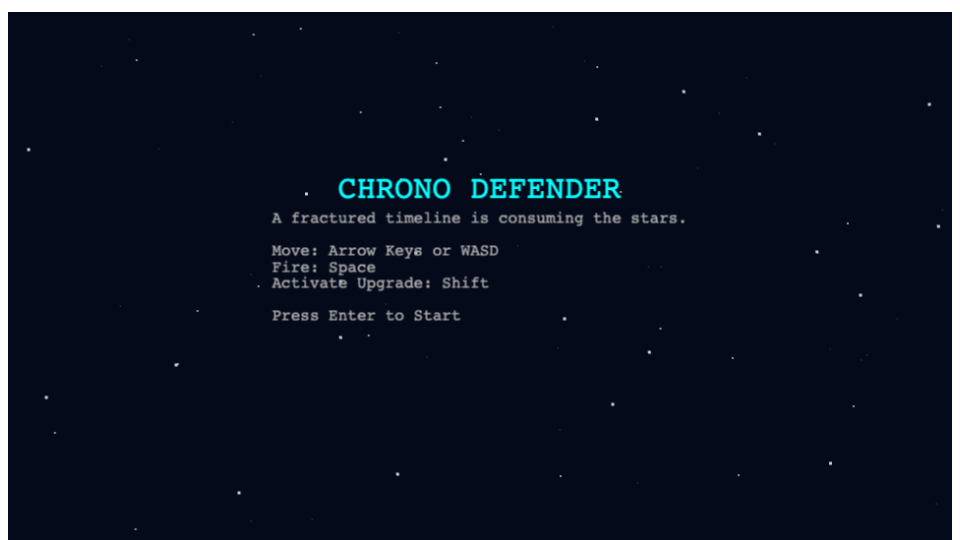
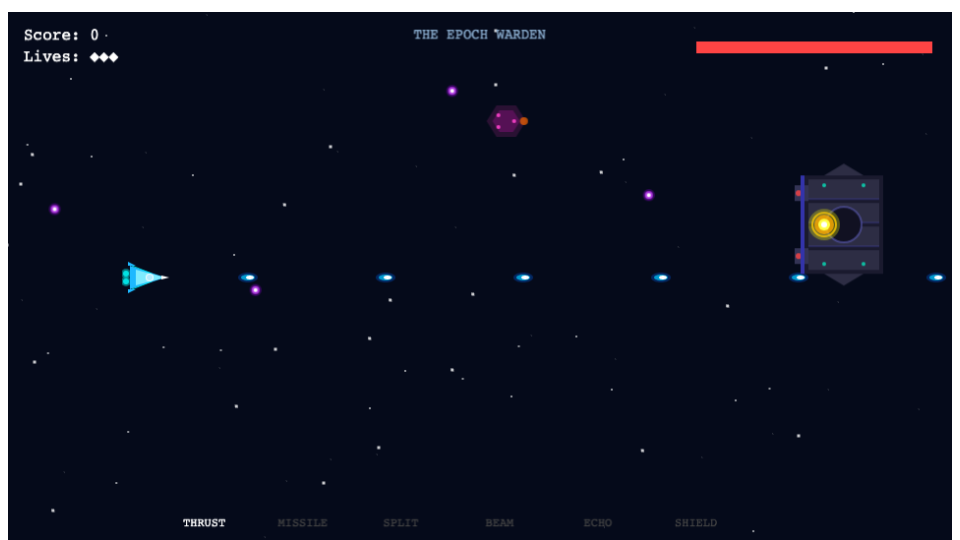
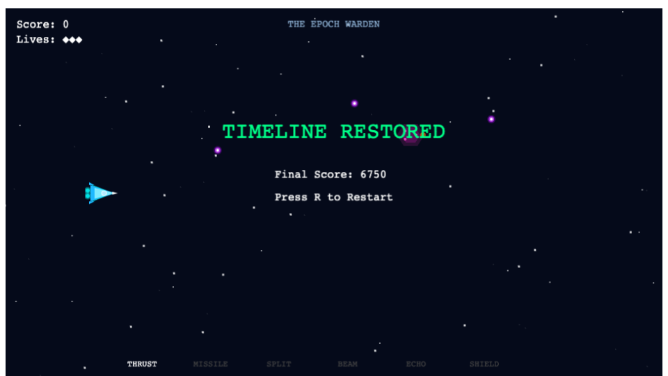

# Chrono Defender

[Leer en Español](README.es.md)

A fractured timeline is consuming the stars. Only the Aegis-7 Chronofighter can stop it.

**Chrono Defender** is an original arcade-inspired horizontal scrolling shoot 'em up built with Phaser 3 and TypeScript. Players pilot an experimental chronofighter through collapsing timelines, collecting Chrono Shards to power upgrades, deploying Echo Drones, and ultimately destroying the Epoch Warden's exposed temporal core.

---

## Play Online

**[Play Chrono Defender](https://robinsonalexanderquiroz-droid.github.io/chrono-defender/)**

---

## Features

- **Horizontal scrolling gameplay** — classic arcade shooter mechanics with modern implementation
- **Original procedural graphics** — all visuals generated at runtime using Phaser Graphics; no external assets
- **Navigable menu system** — title menu with High Scores, Achievements, Options, and Controls screens
- **20 achievements** — combat, survival, collection, mastery, and dedication categories with progress tracking
- **Persistent leaderboard** — top 10 scores saved to localStorage with wave, combo, and result data
- **Gamepad support** — Xbox/PlayStation controllers with analog movement, dead zones, and button mapping
- **Touch controls** — virtual joystick and fire button for mobile browsers
- **Unified input** — keyboard, gamepad, and touch seamlessly combined via InputManager
- **Extended settings** — volume, display, gameplay, and accessibility options with persistence
- **Upgrade Rail system** — collect Chrono Shards to advance through six upgrade slots
- **Echo Drone** — autonomous support orb that mirrors your movement and fires alongside you
- **Boss battle** — face the Epoch Warden with its armored body and vulnerable temporal core
- **Combo scoring** — chain kills for score multipliers up to 4x
- **Five enemy types** — Scouts, Interceptors, Heavies, Bombers, and Snipers with unique movement patterns
- **Six weapons** — Standard Laser, Spread Shot, Triple Shot, Rapid Fire, Piercing Laser, Plasma Beam
- **Eight power-ups** — Health, Shield, Weapon Upgrade, Rapid Fire, Score x2, Drone, Magnet, Invulnerability
- **Adaptive difficulty** — enemy HP, speed, and spawn rate scale with wave progression
- **Mini-boss encounters** — Chrono Sentinel appears every 5 waves
- **Persistent stats** — high score, games played, and bosses defeated saved to localStorage
- **Procedural audio** — background music and 15+ sound effects synthesized at runtime
- **Parallax starfield** — multi-layer scrolling background for depth
- **TypeScript strict mode** — fully typed codebase with zero `any` usage
- **Vite-powered** — fast development server with hot module replacement and optimized production builds
- **MIT Licensed** — free to use, study, and extend

---

## Gameplay






The game progresses through three phases:

1. **Title Screen** — displays controls and lore
2. **Combat Phase** (~65 seconds) — survive enemy waves while collecting upgrades
3. **Boss Phase** — defeat the Epoch Warden by targeting its exposed core

---

## Controls

| Action         | Keyboard          | Gamepad            |
| -------------- | ----------------- | ------------------ |
| Move           | WASD / Arrow Keys | Left Stick / D-Pad |
| Fire           | Space / Click     | A / Cross          |
| Pause / Resume | P / Esc           | Start              |
| Quit to Title  | Q (while paused)  | —                  |
| Mute / Unmute  | M                 | Y / Triangle       |
| Next Weapon    | E                 | Right Bumper       |
| Prev Weapon    | Q                 | Left Bumper        |
| Start Game     | Enter             | A / Cross          |
| Restart        | R                 | —                  |
| Menu Navigate  | Arrow Keys        | D-Pad / Left Stick |
| Confirm        | Enter             | A / Cross          |
| Back           | Escape            | B / Circle         |

---

## Upgrade System

Defeated enemies may drop **Chrono Shards** — golden crystalline energy fragments from fractured timelines. Each collected shard advances the **Upgrade Rail** by one position.

Press **Shift** to activate the currently highlighted upgrade and reset the selector.

| Slot    | Effect                                    |
| ------- | ----------------------------------------- |
| THRUST  | Increases movement speed                  |
| MISSILE | Enhanced firepower (maps to thrust boost) |
| SPLIT   | Fires three projectiles simultaneously    |
| BEAM    | Enhanced fire pattern (maps to split)     |
| ECHO    | Deploys an autonomous Echo Drone          |
| SHIELD  | Absorbs one hit before breaking           |

### Echo Drone

The Echo Drone is an autonomous support orb that:

- Trails behind the player using position history
- Fires whenever the player fires
- Is indestructible but disappears on player death
- Limited to one active drone

### Shield

The Shield:

- Visibly surrounds the player with a pulsing energy ring
- Absorbs exactly one hit from any source
- Breaks and disappears after absorbing damage

---

## Audio

All audio is generated procedurally at runtime using the Web Audio API — no external audio files are loaded.

- **Background music** — unique themes for title screen, gameplay, boss fight, victory, and game over
- **Sound effects** — laser fire, explosions, impacts, pickups, UI feedback
- **Mute toggle** — press M at any time; visual indicator shows mute state
- **Graceful degradation** — the game is fully playable without audio

---

## Technology

| Category    | Tool            |
| ----------- | --------------- |
| Game Engine | Phaser 3.90     |
| Language    | TypeScript 5.9  |
| Build Tool  | Vite 6.4        |
| Linter      | ESLint 10       |
| Formatter   | Prettier 3.9    |
| Unit Tests  | Vitest 4.1      |
| E2E Tests   | Playwright 1.61 |
| CI/CD       | GitHub Actions  |
| Hosting     | GitHub Pages    |

---

## Installation

```bash
# Clone the repository
git clone https://github.com/robinsonalexanderquiroz-droid/chrono-defender.git
cd chrono-defender

# Install dependencies
npm install

# Start development server
npm run dev

# Build for production
npm run build

# Preview production build
npm run preview
```

---

## Available Scripts

| Script                 | Command                      | Description                         |
| ---------------------- | ---------------------------- | ----------------------------------- |
| `npm run dev`          | `vite`                       | Start development server            |
| `npm run build`        | `tsc --noEmit && vite build` | Type-check and build for production |
| `npm run preview`      | `vite preview`               | Preview production build locally    |
| `npm run typecheck`    | `tsc --noEmit`               | Run TypeScript type checking        |
| `npm run lint`         | `eslint .`                   | Lint all project files              |
| `npm run format:check` | `prettier --check .`         | Check formatting                    |
| `npm run test`         | `vitest --run`               | Run unit tests                      |
| `npm run test:e2e`     | `playwright test`            | Run end-to-end tests                |

---

## Project Structure

```
chrono-defender/
├── src/
│   ├── main.ts                 # Application entry point
│   ├── config/
│   │   └── index.ts            # Phaser game configuration
│   ├── scenes/
│   │   └── PrototypeScene.ts   # Main game scene
│   ├── assets/audio/           # Audio assets (planned)
│   ├── domain/                 # Pure game logic (planned)
│   ├── entities/               # Game entities (planned)
│   ├── persistence/            # Storage abstraction (planned)
│   ├── systems/                # Game systems (planned)
│   ├── types/                  # Shared TypeScript types (planned)
│   ├── ui/                     # HUD and overlays (planned)
│   └── utils/                  # Utility functions (planned)
├── tests/
│   ├── unit/                   # Vitest unit tests
│   ├── integration/            # Integration tests
│   └── e2e/                    # Playwright E2E tests
├── public/
│   └── favicon.ico             # Browser favicon
├── index.html                  # Vite HTML entry
├── vite.config.ts              # Vite configuration
├── tsconfig.json               # TypeScript configuration
├── vitest.config.ts            # Vitest configuration
├── playwright.config.ts        # Playwright configuration
├── eslint.config.js            # ESLint flat configuration
├── .prettierrc.json            # Prettier configuration
├── package.json                # Dependencies and scripts
└── LICENSE                     # MIT License
```

---

## Roadmap

### Completed

- [x] Project scaffolding and toolchain
- [x] TypeScript strict configuration
- [x] Vite build pipeline
- [x] ESLint and Prettier integration
- [x] Vitest and Playwright configuration
- [x] Playable horizontal shooter prototype
- [x] Player movement and shooting
- [x] Enemy wave system with difficulty scaling
- [x] Chrono Shard collection
- [x] Upgrade Rail (THRUST, SPLIT, ECHO, SHIELD)
- [x] Echo Drone support system
- [x] Boss battle (Epoch Warden with vulnerable core)
- [x] Procedural visual improvements
- [x] Parallax starfield
- [x] Explosion effects
- [x] Shield pulsing animation
- [x] GitHub Actions CI/CD pipeline
- [x] GitHub Pages deployment
- [x] Procedural audio system
- [x] Background music (title, gameplay, boss, victory, game over)
- [x] Sound effects (15+ synthesized)
- [x] Five enemy types with unique movement patterns
- [x] Six weapon definitions
- [x] Eight power-up types
- [x] Combo scoring system
- [x] Adaptive difficulty scaling
- [x] Mini-boss encounter definitions
- [x] localStorage persistence (high score, stats)
- [x] Data-driven gameplay configuration

### Planned

- [ ] Multiple stages with unique environments
- [ ] High score leaderboard
- [ ] Additional boss encounters
- [ ] Full weapon switching during gameplay
- [ ] Comprehensive unit test suite
- [ ] Playwright E2E smoke tests
- [ ] Mobile-responsive controls
- [ ] Presentation video

---

## Browser Support

| Browser | Versions |
| ------- | -------- |
| Chrome  | Latest 2 |
| Edge    | Latest 2 |
| Firefox | Latest 2 |
| Safari  | Latest 2 |

---

## Contributing

This is currently a personal portfolio project. Contributions, suggestions, and feedback are welcome through GitHub Issues.

---

## License

[MIT](LICENSE) — Copyright (c) 2026 Chrono Defender contributors
